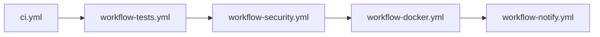
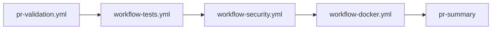

# 🔄 Workflows Organization

This directory contains all GitHub Actions workflows organized with a clear naming convention. **Note**: GitHub Actions only detects workflows in the root `.github/workflows/` directory, not in subdirectories.

## 📁 File Organization

**Entry Points (Main Workflows):**
- `ci.yml` - Main CI/CD pipeline for push events to main/develop
- `pr-validation.yml` - Comprehensive PR validation using same modules

**Reusable Workflow Modules (workflow_call):**
- `workflow-tests.yml` - Test execution and quality checks
- `workflow-security.yml` - Security scanning (Trivy, npm audit, patterns)
- `workflow-docker.yml` - Docker build and push with multi-arch support
- `workflow-sbom.yml` - SBOM generation and attestation

**Monitoring & Observability:**
- `workflow-monitor.yml` - Infrastructure and deployment monitoring
- `workflow-notify.yml` - Notifications and alerts

## 🎯 Workflow Types

### 🚀 **Entry Point Workflows**
- **Entry points** triggered by GitHub events (push, PR)
- **Orchestrate** the execution of module workflows
- **Define** deployment conditions and environment-specific logic

### 🧩 **Module Workflows** (prefixed with `workflow-`)
- **Reusable** workflows called by main workflows via `workflow_call`
- **Single responsibility** - each handles one aspect (tests, security, etc.)
- **Parameterized** - behavior controlled by inputs (`should_deploy`, `ref`, etc.)

### 📊 **Monitoring Workflows** (prefixed with `workflow-`)
- **Event-driven** - triggered by workflow completion events
- **Observability** - track pipeline health and notify on failures
- **Automated** - create issues, send notifications, manage workflow lifecycle

## 🔗 Dependencies

### Main CI Pipeline (`ci.yml`)

### PR Validation (`pr-validation.yml`)

## 🛠️ Usage

### Adding a new module workflow
1. Create the workflow in `modules/`
2. Add `workflow_call` trigger with required inputs
3. Reference it from main workflows using relative path

### Modifying existing workflows
- **Module changes** automatically apply to all consumers
- **Main workflows** control orchestration and deployment logic
- **Monitoring** workflows are independent and event-driven

## 📚 Documentation

For detailed architecture information, see:
- [CI_ARCHITECTURE.md](../CI_ARCHITECTURE.md) - Complete pipeline documentation
- [DEVELOPMENT.md](../../DEVELOPMENT.md) - Local development commands
- [SONARQUBE_SETUP.md](../SONARQUBE_SETUP.md) - SonarQube configuration

## 🔧 Maintenance

### File Naming Conventions
- `main/` - Descriptive names for entry points (`ci.yml`, `pr-validation.yml`)
- `modules/` - Functional names (`tests.yml`, `security.yml`, `docker.yml`)
- `monitoring/` - Action-based names (`monitor.yml`, `notify.yml`)

### Best Practices
1. **Keep modules focused** - single responsibility principle
2. **Use consistent inputs** - `ref`, `should_deploy` pattern
3. **Document changes** - update this README when adding workflows
4. **Test thoroughly** - changes to modules affect multiple consumers