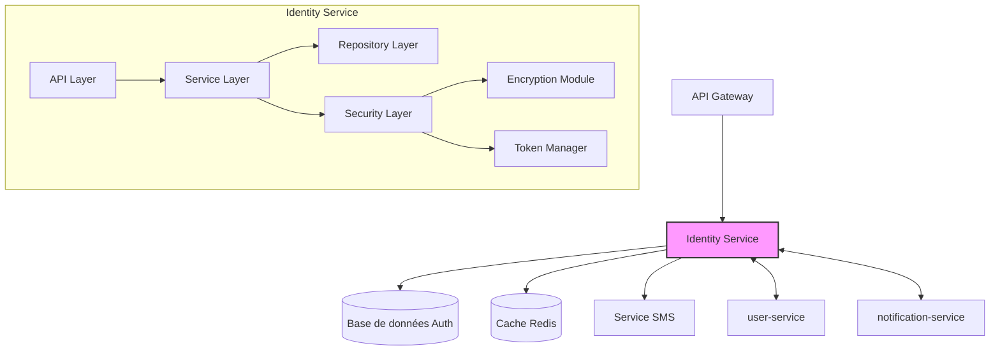

# Authentication Service (`auth-service`) - System Design Document

## 0. Sommaire
1. [Introduction](#1-introduction)
2. [Architecture Globale](#2-architecture-globale)
3. [Choix Technologiques](#3-choix-technologiques)
4. [Composants Principaux](#4-composants-principaux)
5. [Scaling et Performance](#5-scaling-et-performances)
6. [Monitoring et Observabilité](#6-monitoring-et-observabilité)
7. [Gestion des erreurs et Résilience](#7-gestion-des-erreurs-et-résilience)
8. [Évolution et Maintenance](#8-évolution-et-maintenance)
9. [Considérations Opérationnelles](#9-considérations-opérationnelles)


## 1. Introduction

### 1.1 Objectif du Document
Ce document décrit l'architecture et la conception technique du service d'authentification (`auth-service`) de l'application Whispr. Il sert de référence pour l'équipe de développement et les parties prenantes du projet.

### 1.2 Périmètre du Service
Le service `auth` est responsable de toutes les fonctionnalités liées à l'authentification des utilisateurs, à la gestion des sessions, à l'authentification à deux facteurs, et à la gestion des clés de chiffrement pour le protocole Signal (E2E).

### 1.3 Relations avec les Autres Services
Ce service est fondamental dans l'architecture Whispr car il fournit **l'authentification** et **l'autorisation** pour tous les autres microservices. 

Il communique principalement avec:
- **user-service**: pour la gestion des profils utilisateurs (via gRPC)
- **notification-service**: pour l'envoi des notifications push
- **Service SMS externe**: pour l'envoi des codes de vérification (Twilio, Vonage, etc.)
- Tous les autres services via l'API Gateway pour la validation des tokens

## 2. Architecture Globale

### 2.1 Vue d'Ensemble de l'Architecture

Le service d'authentification suit une architecture en couches avec séparation des responsabilités:



### 2.2 Principes Architecturaux

- **Stateless**: Le service opère sans état pour faciliter le scaling horizontal
- **Sécurité par Design**: Implémentation des meilleures pratiques de sécurité à chaque niveau
- **Résilience**: Gestion des défaillances avec graceful degradation
- **Observabilité**: Logging structuré et métriques détaillées
- **DevSecOps**: Intégration continue avec tests de sécurité automatisés

## 3. Choix Technologiques

### 3.1 Stack Technique

- **Langage**: TypeScript
- **Framework**: NestJS (framework Node.js)
- **Stockage temporaire**:
  - Redis pour les données temporaires (codes de vérification, challenges, sessions)
- **Communication inter-services**: gRPC pour les appels synchrones entre services
- **ORM**: Non applicable (données utilisateur stockées dans user-service)
- **Authentification**: JWT pour les tokens, bcrypt pour le hachage des secrets
- **Chiffrement**: librairies Signal Protocol officielles
- **API**: REST avec OpenAPI/Swagger (via décorateurs NestJS)
- **Cache**: Redis (via @nestjs/cache-manager)
- **Message Queue**: (optionnel) RabbitMQ ou GCP Pub/Sub via @nestjs/microservices
- **Service SMS**: Intégration avec un service SMS externe (Twilio, Vonage, etc.)

### 3.2 Infrastructure

- **Containerisation**: Docker
- **Orchestration**: Kubernetes (GKE)
- **CI/CD**: GitHub Actions
- **Service Cloud**: Google Cloud Platform (GCP)
- **Monitoring**: Prometheus + Grafana
- **Logging**: Loki
- **Tracing**: OpenTelemetry

## 4. Composants Principaux

### 4.1 Structure NestJS

L'architecture NestJS du service est organisée comme suit:

```
src/
├── main.ts                    # Point d'entrée de l'application
├── app.module.ts              # Module racine
├── modules/                   # Modules fonctionnels
│   ├── auth/                  # Module d'authentification
│   ├── verification/          # Module de vérification
│   ├── twoFactor/             # Module 2FA
│   └── keyManagement/         # Module de gestion des clés
├── shared/                    # Code partagé entre modules
│   ├── guards/                # Guards d'authentification
│   ├── interceptors/          # Interceptors (logging, transformation)
│   ├── pipes/                 # Pipes de validation
│   ├── filters/               # Filtres d'exception
│   └── decorators/            # Décorateurs personnalisés
└── config/                    # Configuration de l'application
```

### 4.2 Controllers (API Layer)

Les Controllers NestJS exposent les endpoints RESTful:
- **AuthController**: endpoints d'enregistrement et login
- **VerificationController**: endpoints de vérification par SMS
- **TwoFactorController**: endpoints de gestion 2FA
- **KeyController**: endpoints de gestion des clés Signal

Avantages:
- Décorateurs pour définir les routes, méthodes HTTP et validation
- Génération automatique de la documentation Swagger via @nestjs/swagger
- Gestion des réponses HTTP standardisée

### 4.3 Services (Business Logic Layer)

Providers NestJS contenant la logique métier:
- **AuthService**: gestion des processus d'authentification
- **VerificationService**: vérification par SMS
- **TwoFactorService**: gestion de l'authentification à deux facteurs
- **KeyManagementService**: gestion des clés pour le protocole Signal

Avantages:
- Injection de dépendances automatique
- Testabilité améliorée (facilité de mock)
- Séparation claire des responsabilités

### 4.4 Repositories (Data Access Layer)

Gère les accès aux données via TypeORM:
- **UserRepository**: opérations liées aux utilisateurs
- **KeyRepository**: opérations liées aux clés cryptographiques
- **VerificationRepository**: gestion des codes de vérification temporaires

### 4.5 Guards et Interceptors (Security Layer)

Centralise les fonctionnalités de sécurité:
- **JwtAuthGuard**: validation des tokens JWT
- **RateLimitInterceptor**: protection contre les attaques par force brute
- **TwoFactorGuard**: vérification de l'authentification à deux facteurs
- **EncryptionService**: gestion du chiffrement Signal

### 4.6 Communication avec les autres services

- **@nestjs/microservices**: pour l'intégration gRPC avec les autres services
- Création d'interfaces gRPC pour les communications inter-services:
  - Interface UserService: récupération de profils, création d'utilisateurs
  - Interface NotificationService: envoi de notifications push
  
### 4.7 Configuration et Modules

- **ConfigModule** (@nestjs/config): gestion des variables d'environnement
- **CacheModule**: intégration Redis pour le cache et les données temporaires
- **ThrottlerModule**: limitation de débit intégrée
- **JwtModule**: gestion des tokens JWT
- **GrpcModule**: communication avec les autres microservices

## 5. Scaling et Performances

### 5.1 Stratégie de Scaling

- Scaling horizontal des instances de service via Kubernetes
- Répliques multiples sans état pour faciliter le scaling (NestJS est stateless)
- Séparation du trafic de lecture/écriture si nécessaire
- Utilisation de @nestjs/terminus pour les health checks Kubernetes

### 5.2 Cache et Optimisations

- Mise en cache des validations de token fréquentes
- Redis pour accélérer les opérations fréquentes
- Optimisation des requêtes de base de données (indices appropriés)

### 5.3 Limites et Quotas

- Rate limiting par utilisateur/IP
- Quotas sur les opérations sensibles (création de comptes, vérifications SMS)
- Timeout appropriés pour les opérations externes (envoi de SMS)

## 6. Monitoring et Observabilité

### 6.1 Logging

- Logs structurés en JSON via @nestjs/common Logger ou winston intégration
- Utilisation du LoggingInterceptor NestJS pour le logging automatique des requêtes
- Niveaux de log différenciés (INFO, WARN, ERROR, DEBUG)
- Contexte inclus (userId, requestId, etc.) via NestJS request context
- Sensibilité aux données personnelles (masquage)

### 6.2 Métriques

- Taux de réussite/échec des authentifications
- Latence des opérations principales
- Nombre de tentatives de vérification
- Utilisation des ressources système

### 6.3 Alerting

- Alertes sur taux d'échec anormal
- Alertes sur tentatives suspectes (multiples échecs)
- Alertes sur latence élevée
- Alertes sur épuisement des ressources

## 7. Gestion des Erreurs et Résilience

### 7.1 Stratégie de Gestion des Erreurs

- Utilisation des ExceptionFilters NestJS pour gérer les erreurs de manière centralisée
- Codes d'erreur standardisés via HttpException et dérivés personnalisés
- Messages d'erreur clairs mais sans divulgation d'informations sensibles
- Logging détaillé des erreurs pour le débogage
- Possibilité d'enrichir les exceptions via les interceptors NestJS

### 7.2 Résilience

- Circuit breakers pour les services externes
- Retries avec backoff exponentiel
- Graceful degradation (modes dégradés)
- Heartbeats pour vérifier la santé des dépendances

### 7.3 Plan de Reprise d'Activité

- RPO (Recovery Point Objective): 1 heure max
- RTO (Recovery Time Objective): 2 heures max
- Sauvegardes régulières de la base de données
- Procédures de restauration documentées

## 8. Évolution et Maintenance

### 8.1 Versionnement

- Versionnement sémantique des API
- Rétrocompatibilité maintenue pour les clients existants
- Période de dépréciation avant suppression de fonctionnalités

### 8.2 Mise à Jour et Déploiement
- GitOps avec ArgoCD
- Stratégie de déploiement blue/green
- Tests automatisés avant déploiement
- Rollback automatique en cas d'échec
- Fenêtres de maintenance planifiées (si nécessaire)

### 8.3 Documentation Technique

- Documentation OpenAPI générée automatiquement via @nestjs/swagger et décorateurs
- Exemples de code pour l'intégration
- Flux documentés pour les opérations complexes
- Guide de dépannage pour les problèmes courants
- Documentation automatique des DTO et entités via décorateurs Swagger

## 9. Considérations Opérationnelles

### 9.1 DevOps

- Pipeline CI/CD via GitHub Actions
- Intégration continue avec tests automatisés
- Déploiement continu en environnement de développement et staging via ArgoCD

### 9.2 Environnements

- Développement, Staging, Production
- Isolation complète des données entre environnements
- Parité des configurations entre environnements

### 9.3 Support

- Logs centralisés pour le diagnostic
- Outils de tracing des requêtes
- Procédures documentées pour les problèmes courants

---

## Appendices

### A. Métriques de Performance Cibles

| Métrique | Cible |
|----------|-------|
| Temps de réponse moyen | < 200ms |
| 99e percentile temps de réponse | < 1s |
| Taux d'erreur | < 0.1% |
| Disponibilité | > 99% |
| Temps moyen de vérification SMS | < 10s |
| Empreinte mémoire par instance NestJS | < 300MB |
| CPU utilisation moyenne | < 50% |

### B. Estimation des Ressources

| Ressource | Estimation Initiale |
|-----------|---------------------|
| Instances de service | 3 replicas |
| CPU par instance | 1 vCPU |
| Mémoire par instance | 2 GB RAM |
| Stockage PostgreSQL | 20 GB initial |
| Stockage Redis | 2 GB |
| Bandwidth mensuel | 50 GB |

### C. Références

- [Spécification OpenAPI complète](../5_integration/swagger.yaml)
- [Schéma de sécurité Whispr](./security_policy.md)
- [Exigences non fonctionnelles](./non_fonctional_specs.md)
- [Documentation officielle NestJS](https://docs.nestjs.com/)
- [Bonnes pratiques NestJS](https://docs.nestjs.com/techniques/performance)
- [TypeORM avec NestJS](https://docs.nestjs.com/techniques/database)