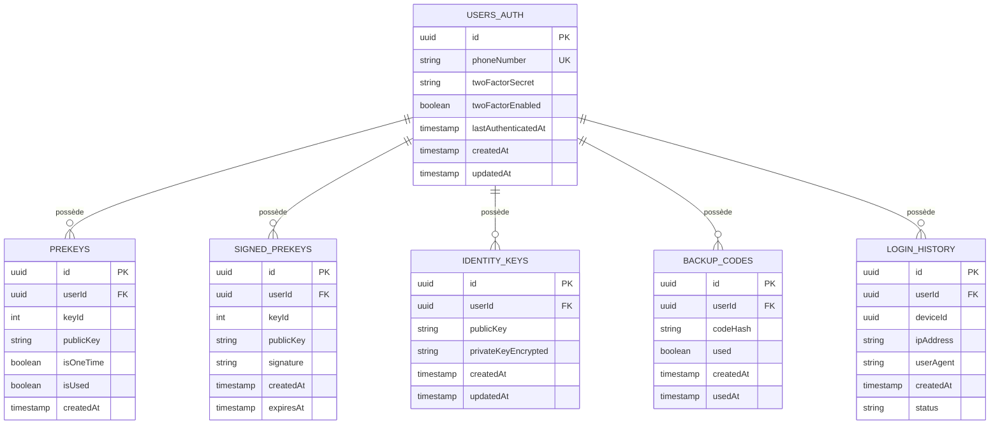
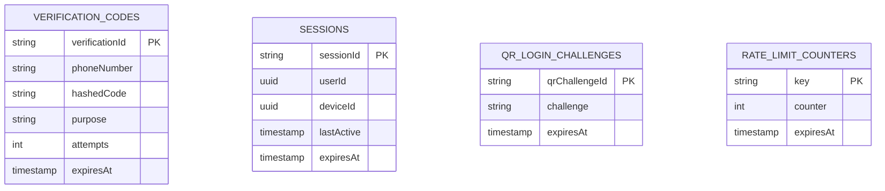
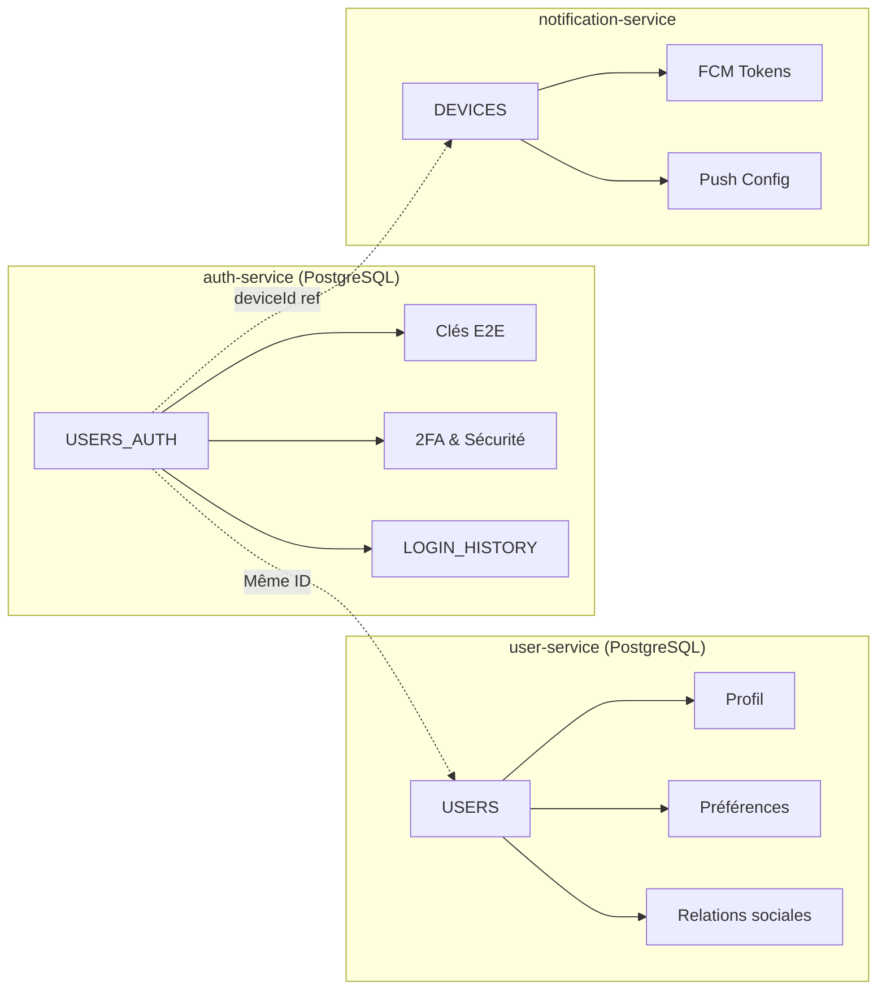
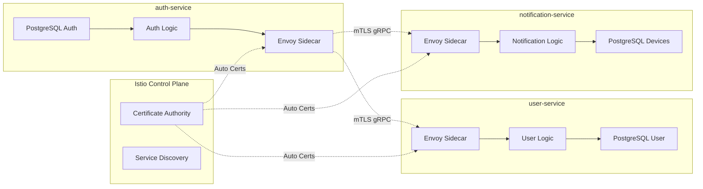

# Authentication Service (`auth-service`) - Conception de la Base de Données

## 0. Sommaire

- [1. Introduction et Principes de Conception](#1-introduction-et-principes-de-conception)
  - [1.1 Objectif](#11-objectif)
  - [1.2 Principes Architecturaux](#12-principes-architecturaux)
  - [1.3 Technologie](#13-technologie)
- [2. Schéma PostgreSQL du Service d'Authentification](#2-schéma-postgresql-du-service-dauthentification)
  - [2.1 Vue d'Ensemble](#21-vue-densemble)
  - [2.2 Description des Tables](#22-description-des-tables)
- [3. Données Temporaires dans Redis](#3-données-temporaires-dans-redis)
  - [3.1 Vue d'Ensemble](#31-vue-densemble)
  - [3.2 Description des Structures Redis](#32-description-des-structures-redis)
- [4. Relations avec les Autres Services](#4-relations-avec-les-autres-services)
  - [4.1 Démarcation des Responsabilités](#41-démarcation-des-responsabilités)
  - [4.2 Synchronisation des Données](#42-synchronisation-des-données)
- [5. Considérations de Sécurité](#5-considérations-de-sécurité)
  - [5.1 Chiffrement des Données Sensibles](#51-chiffrement-des-données-sensibles)
  - [5.2 Hachage des Secrets](#52-hachage-des-secrets)
  - [5.3 Audit et Logging](#53-audit-et-logging)
- [6. Considérations de Performance](#6-considérations-de-performance)
  - [6.1 Indexation](#61-indexation)
  - [6.2 Partitionnement](#62-partitionnement)
  - [6.3 Optimisations Redis](#63-optimisations-redis)
- [7. Migrations et Évolution du Schéma](#7-migrations-et-évolution-du-schéma)
  - [7.1 Stratégie de Migration](#71-stratégie-de-migration)
- [8. Scripts SQL d'Initialisation](#8-scripts-sql-dinitialisation)
  - [8.1 Création du Schéma PostgreSQL](#81-création-du-schéma-postgresql)
- [9. Communication Inter-Services](#9-communication-inter-services)
  - [9.1 Événements et Synchronisation](#91-événements-et-synchronisation)
  - [9.2 Gestion des Références Externes](#92-gestion-des-références-externes)

## 1. Introduction et Principes de Conception

### 1.1 Objectif
Ce document décrit la structure de la base de données du service d'authentification (auth-service) de l'application Whispr, en détaillant les modèles de données, les relations, et les considérations de performance.

### 1.2 Principes Architecturaux
- **Séparation des domaines**: Chaque service gère ses propres données dans sa propre base de données
- **Dénormalisation contrôlée**: Duplication minimale des données nécessaires à l'autonomie du service
- **Haute performance**: Optimisation pour les opérations d'authentification fréquentes
- **Sécurité par conception**: Attention particulière au stockage sécurisé des données sensibles

### 1.3 Technologie
- **PostgreSQL**: Pour les données persistantes d'authentification
- **Redis**: Pour les données temporaires (codes de vérification, sessions, challenges)

## 2. Schéma PostgreSQL du Service d'Authentification

### 2.1 Vue d'Ensemble



### 2.2 Description des Tables

#### 2.2.1 USERS_AUTH
Stocke les informations minimales nécessaires pour l'authentification des utilisateurs.

| Colonne | Type | Description | Contraintes |
|---------|------|-------------|-------------|
| id | UUID | Identifiant unique de l'utilisateur | PK, NOT NULL |
| phoneNumber | VARCHAR(20) | Numéro de téléphone au format E.164 | UNIQUE, NOT NULL |
| twoFactorSecret | VARCHAR(255) | Secret TOTP pour l'authentification à deux facteurs | ENCRYPTED, NULL |
| twoFactorEnabled | BOOLEAN | Indique si l'authentification à deux facteurs est activée | NOT NULL, DEFAULT FALSE |
| lastAuthenticatedAt | TIMESTAMP | Date/heure de la dernière authentification réussie | NULL |
| createdAt | TIMESTAMP | Date/heure de création du compte | NOT NULL |
| updatedAt | TIMESTAMP | Date/heure de la dernière mise à jour | NOT NULL |

**Indices**:
- PRIMARY KEY sur `id`
- UNIQUE sur `phoneNumber`
- INDEX sur `phoneNumber` pour les recherches fréquentes

#### 2.2.2 PREKEYS
Stocke les clés préalables (pre-keys) pour le protocole Signal.

| Colonne | Type | Description | Contraintes |
|---------|------|-------------|-------------|
| id | UUID | Identifiant unique de la clé | PK, NOT NULL |
| userId | UUID | Référence à l'utilisateur propriétaire | FK (USERS_AUTH.id), NOT NULL |
| keyId | INTEGER | Identifiant de la clé dans le protocole | NOT NULL |
| publicKey | TEXT | Clé publique encodée | NOT NULL |
| isOneTime | BOOLEAN | Indique s'il s'agit d'une clé à usage unique | NOT NULL, DEFAULT TRUE |
| isUsed | BOOLEAN | Indique si la clé a déjà été utilisée | NOT NULL, DEFAULT FALSE |
| createdAt | TIMESTAMP | Date/heure de création | NOT NULL |

**Indices**:
- PRIMARY KEY sur `id`
- UNIQUE sur `(userId, keyId)` pour éviter les doublons
- INDEX sur `userId` pour les recherches

#### 2.2.3 SIGNED_PREKEYS
Stocke les clés préalables signées pour le protocole Signal.

| Colonne | Type | Description | Contraintes |
|---------|------|-------------|-------------|
| id | UUID | Identifiant unique de la clé | PK, NOT NULL |
| userId | UUID | Référence à l'utilisateur propriétaire | FK (USERS_AUTH.id), NOT NULL |
| keyId | INTEGER | Identifiant de la clé dans le protocole | NOT NULL |
| publicKey | TEXT | Clé publique encodée | NOT NULL |
| signature | TEXT | Signature cryptographique | NOT NULL |
| createdAt | TIMESTAMP | Date/heure de création | NOT NULL |
| expiresAt | TIMESTAMP | Date/heure d'expiration | NOT NULL |

**Indices**:
- PRIMARY KEY sur `id`
- UNIQUE sur `(userId, keyId)` pour éviter les doublons
- INDEX sur `userId` pour les recherches

#### 2.2.4 IDENTITY_KEYS
Stocke les clés d'identité pour le protocole Signal.

| Colonne | Type | Description | Contraintes |
|---------|------|-------------|-------------|
| id | UUID | Identifiant unique de la clé | PK, NOT NULL |
| userId | UUID | Référence à l'utilisateur propriétaire | FK (USERS_AUTH.id), NOT NULL |
| publicKey | TEXT | Clé publique encodée | NOT NULL |
| privateKeyEncrypted | TEXT | Clé privée chiffrée (si nécessaire) | ENCRYPTED, NULL |
| createdAt | TIMESTAMP | Date/heure de création | NOT NULL |
| updatedAt | TIMESTAMP | Date/heure de la dernière mise à jour | NOT NULL |

**Indices**:
- PRIMARY KEY sur `id`
- UNIQUE sur `userId` (un utilisateur a une seule clé d'identité active)

#### 2.2.5 BACKUP_CODES
Stocke les codes de secours pour l'authentification 2FA.

| Colonne | Type | Description | Contraintes |
|---------|------|-------------|-------------|
| id | UUID | Identifiant unique du code | PK, NOT NULL |
| userId | UUID | Référence à l'utilisateur propriétaire | FK (USERS_AUTH.id), NOT NULL |
| codeHash | VARCHAR(255) | Hachage du code de secours | NOT NULL |
| used | BOOLEAN | Indique si le code a été utilisé | NOT NULL, DEFAULT FALSE |
| createdAt | TIMESTAMP | Date/heure de création | NOT NULL |
| usedAt | TIMESTAMP | Date/heure d'utilisation | NULL |

**Indices**:
- PRIMARY KEY sur `id`
- INDEX sur `userId` pour les recherches

#### 2.2.6 LOGIN_HISTORY
Enregistre l'historique des connexions.

| Colonne | Type | Description | Contraintes |
|---------|------|-------------|-------------|
| id | UUID | Identifiant unique de l'entrée | PK, NOT NULL |
| userId | UUID | Référence à l'utilisateur | FK (USERS_AUTH.id), NOT NULL |
| deviceId | UUID | Identifiant de l'appareil utilisé (référence externe) | NULL |
| ipAddress | VARCHAR(45) | Adresse IP de la connexion | NOT NULL |
| userAgent | TEXT | User-agent du client | NULL |
| createdAt | TIMESTAMP | Date/heure de la tentative | NOT NULL |
| status | VARCHAR(20) | Statut (success, failed, etc.) | NOT NULL |

**Indices**:
- PRIMARY KEY sur `id`
- INDEX sur `userId` pour les recherches
- INDEX sur `createdAt` pour les requêtes temporelles

**Note**: Le `deviceId` est conservé pour l'audit et la traçabilité mais ne fait plus référence à une table locale. Les informations sur les appareils sont maintenant gérées par le service de notification.

## 3. Données Temporaires dans Redis

### 3.1 Vue d'Ensemble

Redis est utilisé pour stocker des données temporaires et à haute disponibilité:



### 3.2 Description des Structures Redis

#### 3.2.1 VERIFICATION_CODES
Stocke les codes de vérification temporaires envoyés par SMS.

**Clé**: `verification:{verificationId}`  
**Type**: Hash  
**TTL**: 15 minutes  
**Champs**:
- `phoneNumber`: Numéro de téléphone cible
- `hashedCode`: Code de vérification haché
- `purpose`: Objectif (registration, login, recovery, phone_change)
- `attempts`: Nombre de tentatives effectuées
- `expiresAt`: Horodatage d'expiration

#### 3.2.2 SESSIONS
Stocke les informations de session active.

**Clé**: `session:{sessionId}`  
**Type**: Hash  
**TTL**: Variable (selon la durée de validité du token)  
**Champs**:
- `userId`: ID de l'utilisateur
- `deviceId`: ID de l'appareil (référence externe)
- `tokenFamily`: Famille de tokens pour le refresh
- `lastActive`: Dernière activité
- `expiresAt`: Horodatage d'expiration

#### 3.2.3 QR_LOGIN_CHALLENGES
Stocke les challenges pour l'authentification par QR code.

**Clé**: `qr_challenge:{qrChallengeId}`  
**Type**: Hash  
**TTL**: 5 minutes  
**Champs**:
- `challenge`: Challenge cryptographique
- `expiresAt`: Horodatage d'expiration

#### 3.2.4 RATE_LIMIT_COUNTERS
Compteurs pour la limitation de débit.

**Clé**: `rate_limit:{type}:{identifier}`  
**Type**: String (counter)  
**TTL**: Variable selon le type de limite  
**Valeur**: Nombre de tentatives

## 4. Relations avec les Autres Services

### 4.1 Démarcation des Responsabilités



### 4.2 Synchronisation des Données

- **ID Utilisateur**: Même UUID utilisé dans les deux services
- **Création**: Création atomique dans auth-service suivi d'un événement pour user-service
- **Modification du numéro de téléphone**: Nécessite mise à jour dans les deux services
- **Appareils**: Les informations sur les appareils sont maintenant gérées par le notification-service

## 5. Considérations de Sécurité

### 5.1 Chiffrement des Données Sensibles

- **Niveau Colonne**: Les colonnes contenant des informations sensibles (twoFactorSecret, privateKeyEncrypted) sont chiffrées au repos
- **Méthode**: Chiffrement AES-256-GCM avec rotation des clés

### 5.2 Hachage des Secrets

- Les codes de vérification sont stockés sous forme hachée (bcrypt ou PBKDF2)
- Les codes de secours sont également hachés avec sel unique

### 5.3 Audit et Logging

- Toutes les opérations sensibles sont enregistrées dans la table LOGIN_HISTORY
- Timestamps d'audit sur toutes les tables (createdAt, updatedAt)

## 6. Considérations de Performance

### 6.1 Indexation

- Index sur les colonnes fréquemment recherchées (phoneNumber, userId, etc.)
- Index composites pour les requêtes courantes

### 6.2 Partitionnement

- La table LOGIN_HISTORY peut être partitionnée par plage de dates pour les performances à long terme

### 6.3 Optimisations Redis

- TTL appropriés pour éviter la croissance excessive
- Utilisation de Redis Cluster pour la haute disponibilité (optionnel)

## 7. Migrations et Évolution du Schéma

### 7.1 Stratégie de Migration

- Migrations progressives avec versionnement
- Support pour la compatibilité descendante
- Tests automatisés des migrations

## 8. Scripts SQL d'Initialisation

### 8.1 Création du Schéma PostgreSQL

```sql
CREATE EXTENSION IF NOT EXISTS "uuid-ossp";

-- Table des utilisateurs pour l'authentification
CREATE TABLE users_auth (
    id UUID PRIMARY KEY DEFAULT uuid_generate_v4(),
    phone_number VARCHAR(20) NOT NULL UNIQUE,
    two_factor_secret VARCHAR(255),
    two_factor_enabled BOOLEAN NOT NULL DEFAULT FALSE,
    last_authenticated_at TIMESTAMP,
    created_at TIMESTAMP NOT NULL DEFAULT NOW(),
    updated_at TIMESTAMP NOT NULL DEFAULT NOW()
);

-- Table des prekeys
CREATE TABLE prekeys (
    id UUID PRIMARY KEY DEFAULT uuid_generate_v4(),
    user_id UUID NOT NULL REFERENCES users_auth(id) ON DELETE CASCADE,
    key_id INTEGER NOT NULL,
    public_key TEXT NOT NULL,
    is_one_time BOOLEAN NOT NULL DEFAULT TRUE,
    is_used BOOLEAN NOT NULL DEFAULT FALSE,
    created_at TIMESTAMP NOT NULL DEFAULT NOW(),
    UNIQUE(user_id, key_id)
);

-- Table des prekeys signées
CREATE TABLE signed_prekeys (
    id UUID PRIMARY KEY DEFAULT uuid_generate_v4(),
    user_id UUID NOT NULL REFERENCES users_auth(id) ON DELETE CASCADE,
    key_id INTEGER NOT NULL,
    public_key TEXT NOT NULL,
    signature TEXT NOT NULL,
    created_at TIMESTAMP NOT NULL DEFAULT NOW(),
    expires_at TIMESTAMP NOT NULL,
    UNIQUE(user_id, key_id)
);

-- Table des clés d'identité
CREATE TABLE identity_keys (
    id UUID PRIMARY KEY DEFAULT uuid_generate_v4(),
    user_id UUID NOT NULL UNIQUE REFERENCES users_auth(id) ON DELETE CASCADE,
    public_key TEXT NOT NULL,
    private_key_encrypted TEXT,
    created_at TIMESTAMP NOT NULL DEFAULT NOW(),
    updated_at TIMESTAMP NOT NULL DEFAULT NOW()
);

-- Table des codes de secours
CREATE TABLE backup_codes (
    id UUID PRIMARY KEY DEFAULT uuid_generate_v4(),
    user_id UUID NOT NULL REFERENCES users_auth(id) ON DELETE CASCADE,
    code_hash VARCHAR(255) NOT NULL,
    used BOOLEAN NOT NULL DEFAULT FALSE,
    created_at TIMESTAMP NOT NULL DEFAULT NOW(),
    used_at TIMESTAMP
);

-- Table de l'historique des connexions
CREATE TABLE login_history (
    id UUID PRIMARY KEY DEFAULT uuid_generate_v4(),
    user_id UUID NOT NULL REFERENCES users_auth(id) ON DELETE CASCADE,
    device_id UUID, -- Référence externe au notification-service
    ip_address VARCHAR(45) NOT NULL,
    user_agent TEXT,
    created_at TIMESTAMP NOT NULL DEFAULT NOW(),
    status VARCHAR(20) NOT NULL
);

-- Création des index
CREATE INDEX idx_prekeys_user_id ON prekeys(user_id);
CREATE INDEX idx_signed_prekeys_user_id ON signed_prekeys(user_id);
CREATE INDEX idx_backup_codes_user_id ON backup_codes(user_id);
CREATE INDEX idx_login_history_user_id ON login_history(user_id);
CREATE INDEX idx_login_history_created_at ON login_history(created_at);
CREATE INDEX idx_login_history_device_id ON login_history(device_id);
```

## 9. Communication Inter-Services avec Istio

### 9.1 Architecture Service Mesh pour les Données

L'auth-service communique avec les autres services via Istio Service Mesh, ce qui impact la façon dont les données sont échangées et synchronisées :



### 9.2 Événements et Synchronisation avec mTLS

Le service d'authentification communique avec les autres services via Istio Service Mesh :

#### 9.2.1 Communications Sécurisées
- **mTLS automatique** : Toutes les communications gRPC sont automatiquement chiffrées et authentifiées
- **Service Identity** : Chaque service a une identité cryptographique unique via SPIFFE
- **Certificate Rotation** : Rotation automatique des certificats par Istio CA
- **Zero Trust** : Aucune communication en clair entre services

#### 9.2.2 Patterns de Communication de Données

**Création d'utilisateur** (auth-service → user-service):
```yaml
# AuthorizationPolicy pour permettre la création d'utilisateur
apiVersion: security.istio.io/v1beta1
kind: AuthorizationPolicy
metadata:
  name: auth-to-user-create
  namespace: whispr
spec:
  selector:
    matchLabels:
      app: user-service
  rules:
  - from:
    - source:
        principals: ["cluster.local/ns/whispr/sa/auth-service"]
  - to:
    - operation:
        methods: ["POST"]
        paths: ["/user.UserService/CreateUser"]
```

**Synchronisation des appareils** (auth-service ↔ notification-service):
```yaml
# AuthorizationPolicy bidirectionnelle pour la gestion des appareils
apiVersion: security.istio.io/v1beta1
kind: AuthorizationPolicy
metadata:
  name: auth-notification-sync
  namespace: whispr
spec:
  selector:
    matchLabels:
      app: notification-service
  rules:
  - from:
    - source:
        principals: ["cluster.local/ns/whispr/sa/auth-service"]
  - to:
    - operation:
        methods: ["POST", "PUT", "DELETE"]
        paths: ["/notification.DeviceService/*"]
```

### 9.3 Gestion des Références Externes avec Istio

#### 9.3.1 Consistance des Données
- **Eventual Consistency** : Les données sont synchronisées de manière asynchrone entre services
- **Saga Pattern** : Gestion des transactions distribuées avec compensation
- **Outbox Pattern** : Publication d'événements de façon fiable
- **Circuit Breakers** : Protection contre les pannes de services externes

#### 9.3.2 Traçabilité et Audit
- **Distributed Tracing** : Chaque transaction de données est tracée via Jaeger
- **Correlation IDs** : Suivi des opérations à travers tous les services
- **Audit Logs** : Enregistrement de toutes les communications inter-services
- **Request Replay** : Possibilité de rejouer les requêtes en cas d'échec

### 9.4 Monitoring des Données Inter-Services

#### 9.4.1 Métriques de Synchronisation
- **Data Sync Success Rate** : Taux de succès des synchronisations de données
- **Cross-Service Latency** : Latence des appels de données entre services
- **Eventual Consistency Lag** : Délai de convergence des données
- **Reference Validation Errors** : Erreurs de validation des références externes

#### 9.4.2 Alertes de Cohérence
- **Orphaned References** : Références d'appareils sans service disponible
- **Sync Failures** : Échecs de synchronisation entre auth-service et notification-service
- **Data Inconsistency** : Détection d'incohérences entre les services
- **Performance Degradation** : Dégradation des performances de synchronisation

### 9.5 Résilience des Données

#### 9.5.1 Stratégies de Fallback
- **Graceful Degradation** : Mode dégradé quand notification-service est indisponible
- **Local Caching** : Cache local des références d'appareils récemment utilisées
- **Retry with Backoff** : Stratégies de retry pour les synchronisations échouées
- **Dead Letter Queue** : File d'attente pour les messages non délivrés

#### 9.5.2 Recovery Procedures
- **Data Reconciliation** : Procédures de réconciliation après pannes
- **Conflict Resolution** : Résolution des conflits de données
- **State Reconstruction** : Reconstruction de l'état des références externes
- **Manual Override** : Possibilité d'intervention manuelle en cas de problème