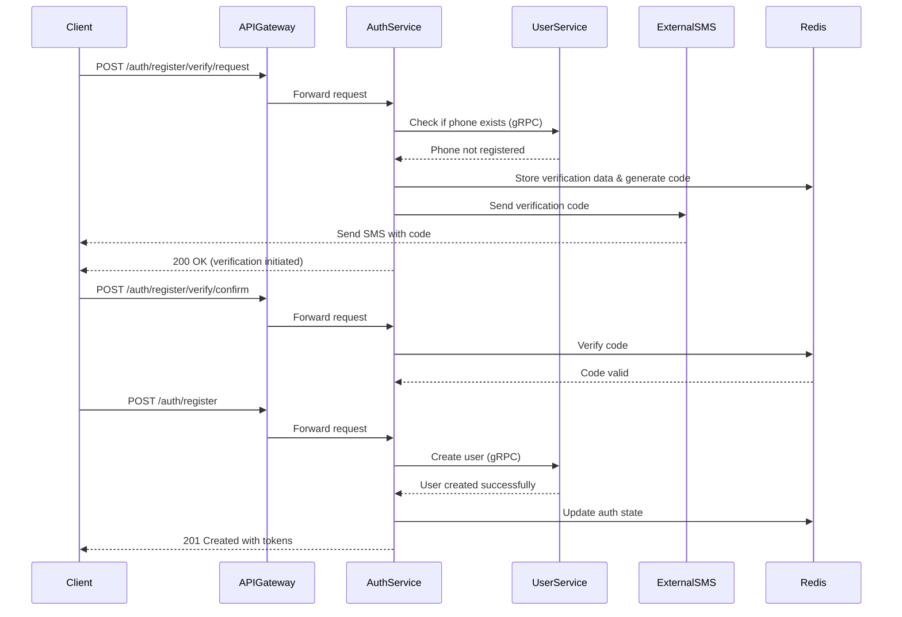
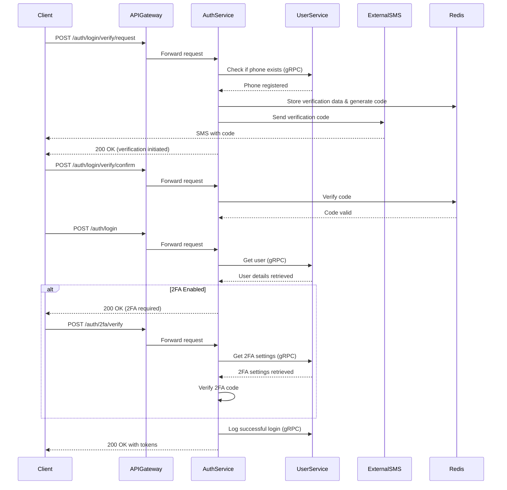
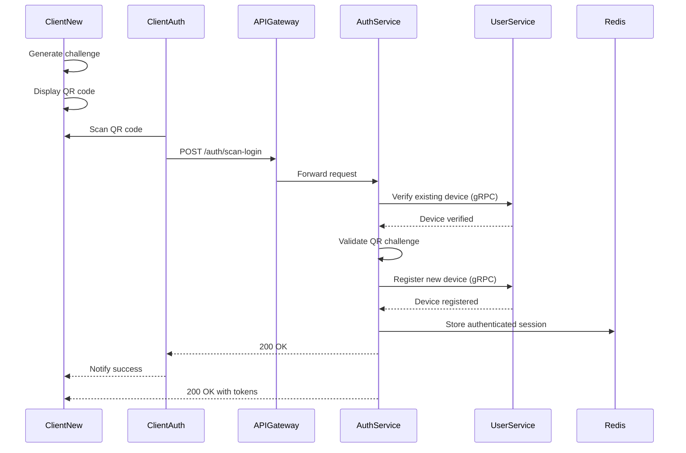

# Spécification Fonctionnelle - Authentification Whispr

## 1. Vue d'ensemble

### 1.1 Objectif

Cette spécification détaille les fonctionnalités d'authentification de l'application Whispr. Elle couvre l'inscription des utilisateurs, la connexion standard et l'authentification multi-appareils via QR code. Ces fonctionnalités constituent le socle sécuritaire de l'application, permettant de garantir l'identité des utilisateurs tout en offrant une expérience utilisateur fluide.

### 1.2 Principes clés

- **Vérification par téléphone**: Confirmation de l'identité par code SMS
- **Sans mot de passe**: Utilisation exclusive de la vérification par téléphone et des tokens
- **Multi-appareils**: Possibilité de se connecter sur plusieurs appareils de manière sécurisée
- **Sécurité renforcée**: Support optionnel de la 2FA (détaillée dans une spécification séparée)
- **Tokens JWT**: Gestion des sessions via tokens d'accès et de rafraîchissement

### 1.3 Composants fonctionnels

Le système d'authentification comprend trois processus principaux:
1. **Inscription**: Vérification du numéro de téléphone et création de compte
2. **Connexion**: Authentification standard avec vérification par SMS
3. **Authentification multi-appareils**: Connexion par scan de QR code

## 2. Processus d'inscription

### 2.1 Explication du processus d'inscription

#### Phase 1: Vérification du numéro de téléphone
1. **Demande de vérification**: L'utilisateur soumet son numéro de téléphone via l'application.
2. **Vérification de disponibilité**: 
   - Le service d'authentification communique avec le service utilisateur via gRPC
   - Vérifie que le numéro n'est pas déjà enregistré dans le système
3. **Génération du code**: 
   - Un code numérique à 6 chiffres est généré aléatoirement
   - Le code est haché et stocké dans Redis avec l'identifiant de vérification et le numéro
   - Un TTL de 15 minutes est appliqué pour limiter la validité temporelle du code
4. **Envoi du SMS**: 
   - Le code est envoyé via un service SMS externe (Twilio ou équivalent)
   - L'application affiche un message de confirmation d'envoi

#### Phase 2: Confirmation du code
1. **Saisie du code**: L'utilisateur entre le code reçu par SMS dans l'application.
2. **Validation**:
   - Le service récupère le hash du code stocké dans Redis avec l'identifiant de vérification
   - Compare le code soumis avec celui stocké (après application du même algorithme de hachage)
   - Vérifie que le code n'a pas expiré et que le nombre de tentatives maximum n'est pas dépassé
3. **Enregistrement de la validation**: 
   - Le statut de vérification est mis à jour dans Redis
   - Une période de validité de 60 minutes est accordée pour finaliser l'inscription

#### Phase 3: Création du compte
1. **Soumission des informations**: L'utilisateur complète son profil (nom, prénom, éventuellement photo).
2. **Création du compte**:
   - Le service d'authentification vérifie que le numéro a bien été validé précédemment
   - Les données utilisateur sont transmises au service utilisateur via gRPC
   - Le service utilisateur crée l'entrée dans sa base de données et attribue un UUID
   - Le service d'authentification crée l'entrée correspondante dans sa propre base
3. **Génération des tokens**: 
   - Un token d'accès (courte durée: 1 heure) est généré
   - Un token de rafraîchissement (longue durée: 30 jours) est généré
   - Les deux tokens sont signés avec l'algorithme ES256
4. **Finalisation**: 
   - Les tokens sont renvoyés au client
   - L'utilisateur est authentifié et peut accéder à l'application

### 2.2 Mesures de sécurité
- **Rate limiting**: Maximum 5 demandes de vérification par numéro par heure
- **Expiration des codes**: Validité de 15 minutes pour limiter les fenêtres d'attaque
- **Tentatives limitées**: Maximum 5 tentatives de validation par code
- **Hachage des codes**: Les codes ne sont jamais stockés en clair
- **Validation séquentielle**: Impossible de créer un compte sans vérification préalable

## 3. Processus d'authentification

### 3.1 Explication du processus d'authentification

#### Phase 1: Vérification du numéro
1. **Demande de vérification**: L'utilisateur soumet son numéro de téléphone pour se connecter.
2. **Vérification d'existence**: 
   - Le service authentification vérifie via gRPC que le numéro est bien enregistré
   - Si le numéro n'existe pas, une erreur est retournée
3. **Génération et envoi du code**: 
   - Processus identique à celui de l'inscription
   - Un code à 6 chiffres est généré, haché et stocké
   - Le code est envoyé par SMS à l'utilisateur

#### Phase 2: Validation du code
1. **Vérification du code**: 
   - L'utilisateur saisit le code reçu
   - Le système vérifie la validité comme pour l'inscription
2. **Validation de l'identité**: 
   - La validation du code confirme que l'utilisateur possède bien le téléphone associé au compte

#### Phase 3: Connexion finale
1. **Requête de connexion**: 
   - Le client demande la connexion en utilisant l'identifiant de vérification validé
2. **Récupération des informations utilisateur**: 
   - Le service d'authentification interroge le service utilisateur pour obtenir les détails du compte
   - Le service vérifie si la 2FA est activée pour ce compte

3. **Vérification 2FA (si activée)**:
   - Si la 2FA est activée, une étape supplémentaire est requise
   - L'utilisateur doit fournir un code généré par son application d'authentification
   - Le processus détaillé est couvert dans la spécification 2FA

4. **Génération des tokens et finalisation**:
   - Comme pour l'inscription, des tokens JWT sont générés
   - L'accès à l'application est accordé
   - La connexion est journalisée pour des raisons de sécurité

### 3.2 Gestion des sessions
- **Token d'accès**: Validité courte (1 heure) pour limiter les risques de vol
- **Token de rafraîchissement**: Validité longue (30 jours) pour éviter les reconnexions fréquentes
- **Révocation possible**: Les tokens peuvent être révoqués en cas de déconnexion volontaire ou de suspicion de compromission
- **Renouvellement transparent**: Le token d'accès peut être renouvelé automatiquement via le token de rafraîchissement

### 3.3 Mesures de sécurité
- **Rate limiting renforcé**: Protection contre les attaques par force brute
- **Détection d'anomalies**: Alertes sur des connexions depuis des localisations inhabituelles
- **Journalisation**: Enregistrement des tentatives de connexion réussies et échouées
- **Empreinte d'appareil**: Inclusion de caractéristiques de l'appareil dans les tokens pour détecter les vols

## 4. Authentification multi-appareils (QR Code)

### 4.1 Explication de l'authentification par QR code

#### Phase 1: Initialisation sur le nouvel appareil
1. **Génération du challenge**: 
   - Le nouvel appareil génère un challenge cryptographique temporaire
   - Ce challenge contient un identifiant de session unique et une signature
   - Une durée de validité courte (5 minutes) est encodée dans le challenge
2. **Affichage du QR code**: 
   - Le challenge est encodé en QR code
   - Un écran d'attente est affiché avec instructions pour l'utilisateur

#### Phase 2: Scan et autorisation
1. **Scan par l'appareil authentifié**: 
   - L'utilisateur utilise un appareil déjà connecté pour scanner le QR code
   - L'application décode le challenge et extrait les informations
2. **Autorisation**: 
   - L'utilisateur confirme qu'il souhaite connecter le nouvel appareil
   - L'appareil authentifié envoie une requête au serveur contenant:
     - Le challenge scanné
     - Son propre token d'authentification
     - Des informations sur le nouvel appareil

#### Phase 3: Validation et enregistrement
1. **Vérification de l'appareil existant**: 
   - Le service authentifie l'appareil qui fait la demande
   - Vérifie que cet appareil appartient bien à l'utilisateur via gRPC
2. **Validation du challenge**: 
   - Vérifie l'authenticité et la validité temporelle du challenge
   - S'assure qu'il n'a pas déjà été utilisé
3. **Enregistrement du nouvel appareil**: 
   - Le service enregistre le nouvel appareil dans la base utilisateur
   - Attribue un identifiant unique à ce nouvel appareil

#### Phase 4: Finalisation
1. **Confirmation à l'appareil authentifié**: 
   - Un message de succès est envoyé à l'appareil qui a scanné le QR
2. **Notification au nouvel appareil**: 
   - Le nouvel appareil est notifié que l'authentification est réussie
   - Des tokens JWT lui sont délivrés pour accéder à l'application
3. **Journalisation**: 
   - L'événement d'ajout d'appareil est enregistré pour des raisons de sécurité

### 4.2 Avantages sécuritaires
- **Pas de saisie d'identifiants**: Réduit les risques de phishing et de vol de credentials
- **Double contrôle**: Nécessite un appareil déjà authentifié pour confirmer l'identité
- **Challenge à usage unique**: Empêche la réutilisation du QR code
- **Expiration rapide**: Limite la fenêtre temporelle d'attaque
- **Confirmation explicite**: L'utilisateur doit activement approuver l'ajout du nouvel appareil

## 5. Gestion des appareils

### 5.1 Liste des appareils
- Chaque utilisateur peut consulter la liste des appareils connectés à son compte
- Les informations suivantes sont affichées:
  - Nom de l'appareil
  - Type d'appareil (iOS, Android, Web)
  - Date de dernière activité
  - Indication de l'appareil courant

### 5.2 Révocation d'appareils
- L'utilisateur peut révoquer l'accès à n'importe quel appareil
- La révocation est immédiate et invalide tous les tokens associés à cet appareil
- Un appareil révoqué devra suivre le processus complet d'authentification pour se reconnecter

### 5.3 Déconnexion à distance
- Un utilisateur peut déconnecter tous ses appareils en cas de suspicion de compromission
- Cette action révoque l'ensemble des tokens et force une nouvelle authentification sur tous les appareils

