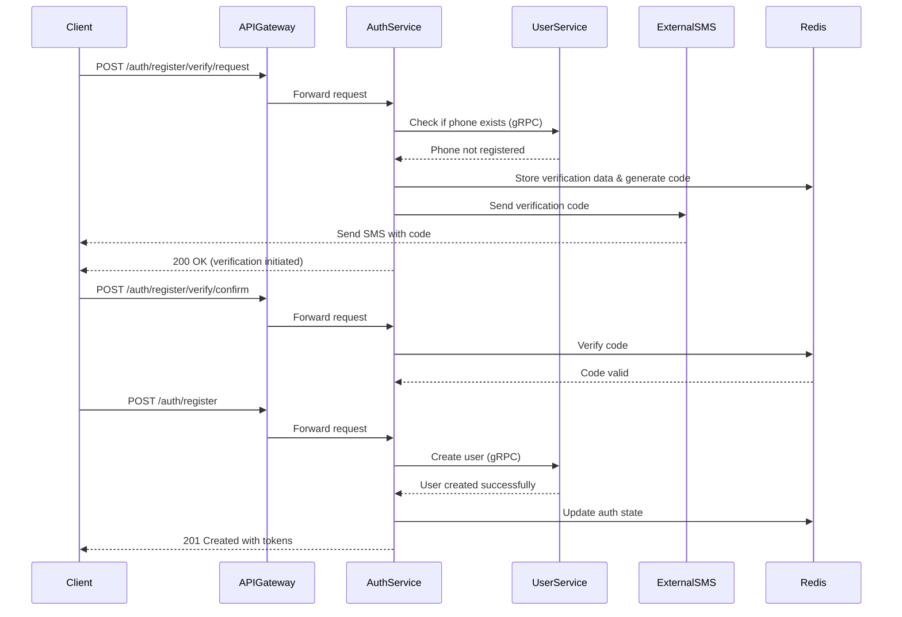
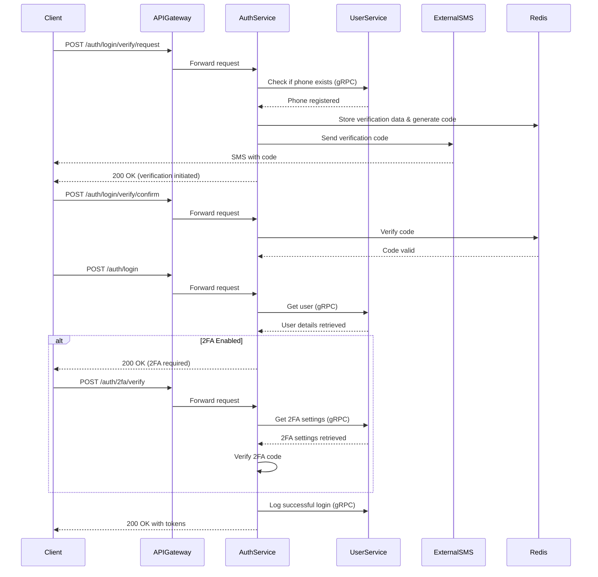
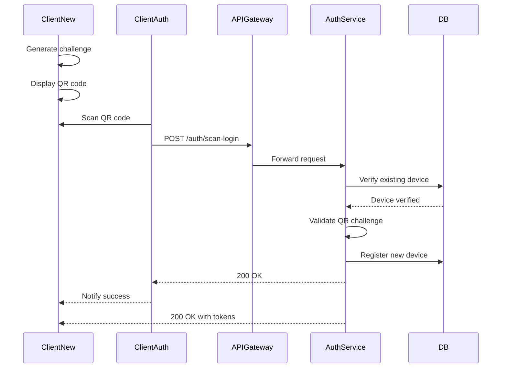

# Authentication flows 

## 1. Registration process

1. Demande de Vérification du Téléphone

    - **Initiation du processus**: L'utilisateur commence par demander la vérification de son numéro de téléphone.
    - **Vérification de disponibilité**: Le service d'authentification communique avec le service utilisateur via gRPC pour vérifier que ce numéro n'est pas déjà enregistré.
    - **Confirmation de disponibilité**: Le service utilisateur confirme que le numéro n'est pas encore utilisé.

2. Génération et Envoi du Code de Vérification

    - **Génération du code**: Le service génère un code de vérification à 6 chiffres unique et aléatoire.
    - **Stockage temporaire**: Ce code est haché et stocké dans Redis avec le numéro de téléphone et un identifiant de vérification unique, avec une durée de vie limitée (15 minutes).
    - **Envoi par SMS**: Le code est envoyé à l'utilisateur via un service SMS externe (comme Twilio).
    - **Confirmation à l'utilisateur**: Le service d'authentification confirme au client que le processus de vérification a bien été initié.

3. Confirmation du Code de Vérification

    - **Soumission du code**: L'utilisateur soumet le code reçu par SMS via l'endpoint dédié.
    - **Vérification du code**: Le service d'authentification récupère les données de vérification dans Redis et compare le code soumis au code haché stocké.
    - **Validation**: Le système confirme que le code est valide et que le numéro de téléphone est bien vérifié.

4. Enregistrement Final de l'Utilisateur

    - **Soumission des données d'enregistrement**: L'utilisateur soumet ses informations complètes (nom, prénom, etc.) pour finaliser son enregistrement.
    - **Création du compte**: Le service d'authentification, ayant vérifié que le numéro de téléphone est bien validé, appelle le service utilisateur via gRPC pour créer le compte.
    - **Persistance dans la base de données**: Le service utilisateur crée l'enregistrement utilisateur dans sa base de données et le confirme.
    - **Mise à jour de l'état d'authentification**: Le service d'authentification met à jour l'état d'authentification dans Redis.
    - **Confirmation finale**: Le service renvoie une confirmation de création avec des tokens JWT d'accès et de rafraîchissement, permettant à l'utilisateur d'accéder à l'application.

Caractéristiques de Sécurité dans ce Processus :

1. **Vérification en deux temps**: Séparation entre la vérification du téléphone et l'enregistrement final.
2. **Protection contre les abus**: Limite du nombre de codes SMS envoyés par numéro.
3. **Sécurisation des codes**: Hachage des codes de vérification dans Redis.
4. **Expiration automatique**: TTL sur les données temporaires de vérification.
5. **Isolation des services**: Communication sécurisée entre auth-service et user-service via gRPC.

## 2. Authentication process

1. Demande de vérification
    - L'utilisateur demande d'abord une vérification par téléphone (POST /auth/login/verify/request)
    - Le service vérifie l'existence du numéro via le user-service
    - Un code de vérification est envoyé par SMS

2. Confirmation du code de vérification
    - L'utilisateur soumet le code reçu (POST /auth/login/verify/confirm)
    - Le code est vérifié contre celui stocké dans Redis

3. Authentification proprement dite
    - L'utilisateur peut alors se connecter (POST /auth/login)
    - Le service récupère les détails complets de l'utilisateur

4. Authentification à deux facteurs (si activée)
    - Si la 2FA est activée, une étape supplémentaire est nécessaire
    - L'utilisateur fournit le code TOTP

5. Finalisation de la connexion
    - Le service enregistre la connexion réussie
    - Les tokens d'authentification sont retournés à l'utilisateur

## 3. Multi-device authentication process (QR Code)

1. Génération du challenge et affichage du QR code

    - **Génération du challenge:** Le nouvel appareil non authentifié (ClientNew) génère un challenge cryptographique unique, qui est essentiellement un jeton temporaire signé contenant un identifiant de session temporaire.
    - **Affichage du QR code:** Ce challenge est encodé dans un QR code qui s'affiche sur l'écran du nouvel appareil.

2. Scan du QR Code par l'Appareil Authentifié

    - L'utilisateur utilise un appareil déjà authentifié (ClientAuth, par exemple son téléphone) pour scanner le QR code affiché sur le nouvel appareil (par exemple sa tablette ou son ordinateur).
    - Le QR code contient le challenge cryptographique et potentiellement un identifiant temporaire du nouvel appareil.

3. Validation serveur
    - L'appareil authentifié envoie le challenge du QR code au serveur via l'endpoint `/auth/scan-login`.
    - La requête contient:

        - Le challenge extrait du QR code
        - L'identifiant de l'appareil authentifié
        - Un token d'authentification prouvant que l'appareil est bien authentifié

    - Le service d'authentification vérifie via gRPC avec le user-service que l'appareil qui fait la demande est bien un appareil légitime de l'utilisateur

4. Validation du Challenge et Enregistrement du Nouvel Appareil
    - Le service d'authentification valide le challenge cryptographique pour s'assurer qu'il est légitime et n'a pas expiré.
    - Si le challenge est valide, le service enregistre le nouvel appareil dans le système via un appel gRPC au user-service.
    - Les informations de l'appareil (nom, type, identifiant unique) sont stockées de manière persistante.

5. Confirmation et Distribution des Tokens
    - Le service d'authentification confirme à l'appareil authentifié que l'opération a réussi.
    - L'appareil authentifié notifie visuellement le nouvel appareil que l'authentification a réussi (par exemple par un signal via WiFi Direct, Bluetooth ou simplement un message visuel demandant à l'utilisateur de revenir sur le nouvel appareil).
    - Le service d'authentification génère des tokens d'authentification (JWT) pour le nouvel appareil et les lui envoie directement.
    - Le nouvel appareil est maintenant authentifié et peut accéder aux services protégés.

    Ce flux d'authentification par QR code offre plusieurs avantages:

    - Expérience utilisateur simplifiée (pas de saisie de mot de passe sur le nouvel appareil)
    - Sécurité renforcée (nécessite un appareil déjà authentifié)
    - Protection contre les attaques de phishing (l'utilisateur n'entre jamais ses identifiants)