# Spécification Fonctionnelle - Authentification à Deux Facteurs (2FA)

## 1. Vue d'ensemble

### 1.1 Objectif

L'authentification à deux facteurs (2FA) renforce la sécurité du processus d'authentification en ajoutant une deuxième couche de vérification, indépendante de la première. Pour Whispr, nous implémentons la 2FA basée sur TOTP (Time-based One-Time Password) conformément à la RFC 6238, compatible avec les applications d'authentification standard comme Google Authenticator, Microsoft Authenticator ou Authy.

### 1.2 Principes clés

- **Quelque chose que vous connaissez** (première couche): Vérification par SMS
- **Quelque chose que vous possédez** (deuxième couche): Code temporaire généré par une application d'authentification
- **Optionnalité**: La 2FA est proposée mais optionnelle pour les utilisateurs
- **Solution de secours**: Des codes de récupération sont fournis en cas de perte d'accès à l'application d'authentification

### 1.3 Composants fonctionnels

Le système 2FA comprend trois processus principaux:
1. **Activation de la 2FA**: Configuration initiale et liaison de l'application d'authentification
2. **Authentification avec 2FA**: Vérification du code temporaire lors de la connexion
3. **Gestion des codes de secours**: Génération, visualisation et utilisation des codes de récupération

## 2. Flux d'activation de la 2FA

```mermaid
sequenceDiagram
    participant User as Utilisateur
    participant Client as Application Client
    participant APIGateway as API Gateway
    participant AuthService as Auth Service
    participant UserService as User Service
    participant Redis as Cache Redis
    
    User->>Client: Demande d'activation de la 2FA
    Client->>APIGateway: POST /auth/2fa/enable
    APIGateway->>AuthService: Forward request
    AuthService->>UserService: Vérifier utilisateur (gRPC)
    UserService-->>AuthService: Utilisateur vérifié
    
    AuthService->>AuthService: Génère secret TOTP
    AuthService->>Redis: Stocke secret temporairement
    AuthService-->>Client: 200 OK avec secret, otpauth_url et QR code
    
    Client->>User: Affiche QR code et clé secrète
    User->>User: Scanne QR code avec app d'authentification
    User->>Client: Entre code de vérification
    
    Client->>APIGateway: POST /auth/2fa/verify
    APIGateway->>AuthService: Forward request
    AuthService->>Redis: Récupère secret temporaire
    AuthService->>AuthService: Valide code TOTP
    
    alt Code valide
        AuthService->>AuthService: Génère 10 codes de secours
        AuthService->>UserService: Active 2FA et stocke secret (gRPC)
        UserService-->>AuthService: 2FA activée
        AuthService-->>Client: 200 OK avec codes de secours
        Client->>User: Affiche codes de secours
        User->>User: Enregistre codes de secours
    else Code invalide
        AuthService-->>Client: 401 Unauthorized
        Client->>User: Affiche erreur de validation
    end
```



### 2.1 Explication du flux d'activation

#### Phase de préparation
1. **Initiation**: L'utilisateur demande l'activation de la 2FA depuis les paramètres de sécurité.
2. **Vérification préalable**: Le service authentifie l'utilisateur et vérifie qu'il n'a pas déjà activé la 2FA.
3. **Génération du secret**: Un secret TOTP aléatoire de 20 octets est généré et encodé en Base32.
4. **Création de l'URL TOTP**: Une URL `otpauth://` est construite selon le format standard, incluant:
   - Le nom de l'application (Whispr)
   - L'identifiant de l'utilisateur (numéro de téléphone ou nom d'utilisateur)
   - Le secret TOTP
   - Les paramètres: algorithme (SHA1), période (30 secondes), digits (6)
5. **Génération du QR Code**: L'URL TOTP est encodée dans un QR code.

#### Phase de validation
1. **Association de l'application**: L'utilisateur scanne le QR code avec son application d'authentification.
2. **Vérification**: L'utilisateur saisit le code à 6 chiffres généré par l'application.
3. **Validation du code**: Le service vérifie que le code est correct, avec une fenêtre de tolérance de ±1 période (30s).
4. **Génération des codes de secours**: Si le code est valide, 10 codes de secours alphanumériques sont générés.
5. **Activation permanente**: Le secret TOTP et les codes de secours (hachés) sont stockés définitivement dans la base de données.
6. **Confirmation**: Les codes de secours sont présentés une seule fois à l'utilisateur pour sauvegarde.

## 3. Flux d'authentification avec 2FA activée


### 3.1 Explication du flux d'authentification

#### Première étape: Vérification du téléphone
1. **Identique au processus standard**: L'utilisateur suit le flux normal de vérification par SMS.
2. **Détection automatique**: Après validation du code SMS, le système détecte que l'utilisateur a activé la 2FA.

#### Deuxième étape: Vérification TOTP
1. **Demande de code 2FA**: L'application demande à l'utilisateur de fournir le code de son application d'authentification.
2. **Génération du code**: L'utilisateur ouvre son application d'authentification qui génère un code à 6 chiffres basé sur:
   - Le secret partagé
   - L'heure actuelle (arrondie à la période de 30 secondes)
3. **Vérification du code**: Le service:
   - Récupère le secret TOTP associé à l'utilisateur
   - Calcule le code attendu pour la période actuelle
   - Compare le code soumis avec le code attendu (avec tolérance)
4. **Finalisation de l'authentification**: Si le code est valide, l'authentification est complétée et les tokens JWT sont émis.

#### Cas d'erreur
- Si le code est invalide, l'utilisateur peut réessayer jusqu'à 5 fois avant blocage temporaire
- Après 5 tentatives infructueuses, l'utilisateur doit attendre 30 minutes ou utiliser un code de secours

## 4. Flux d'utilisation des codes de secours


### 4.1 Explication de l'utilisation des codes de secours

#### Processus de récupération
1. **Option de secours**: L'utilisateur sélectionne l'option "Utiliser un code de secours" s'il ne peut pas accéder à son application d'authentification.
2. **Saisie du code**: L'utilisateur entre l'un des 10 codes de secours qui lui ont été fournis lors de l'activation.
3. **Validation du code**: Le service:
   - Récupère les codes de secours hachés associés à l'utilisateur
   - Compare le hash du code soumis avec les hash stockés
   - Vérifie que le code n'a pas déjà été utilisé
4. **Utilisation à usage unique**: Chaque code ne peut être utilisé qu'une seule fois.
5. **Accès accordé**: Si le code est valide, l'utilisateur reçoit des tokens d'authentification.
6. **Suggestion de reconfiguration**: Il est recommandé à l'utilisateur de désactiver puis réactiver la 2FA s'il a perdu l'accès à son application d'authentification.

#### Gestion des codes de secours
- Les codes sont générés selon un format spécifique (ex: XXXX-XXXX-XXXX) facilitant la lecture
- Ils sont stockés uniquement sous forme hachée dans la base de données
- Chaque code a un indicateur d'utilisation (utilisé/non utilisé)
- L'utilisation d'un code est journalisée pour des raisons de sécurité

## 5. Désactivation de la 2FA


### 5.1 Explication de la désactivation

1. **Demande de désactivation**: L'utilisateur accède à l'option de désactivation dans les paramètres de sécurité.
2. **Confirmation de sécurité**: Pour confirmer son identité, l'utilisateur doit fournir un code TOTP valide de son application d'authentification.
3. **Validation du code**: Le système vérifie que le code est correct avant de procéder.
4. **Suppression des données**: Après validation, le système:
   - Supprime le secret TOTP associé à l'utilisateur
   - Supprime tous les codes de secours associés
   - Met à jour le statut 2FA de l'utilisateur
5. **Confirmation**: L'utilisateur reçoit une confirmation que la 2FA a été désactivée.

## 6. Spécifications techniques

### 6.1 Algorithme TOTP
- **Standard**: RFC 6238 (TOTP) et RFC 4226 (HOTP)
- **Algorithme de hachage**: HMAC-SHA1
- **Longueur du code**: 6 chiffres
- **Période**: 30 secondes
- **Fenêtre de tolérance**: ±1 période (permet d'accepter des codes générés 30 secondes avant/après)
- **Secret**: 20 octets (160 bits) aléatoires, encodés en Base32

### 6.2 Codes de secours
- **Nombre**: 10 codes
- **Format**: Alphanumériques, 12 caractères groupés par 4 (ex: ABCD-EFGH-IJKL)
- **Stockage**: Hachés avec bcrypt (facteur de coût 10)
- **Utilisation**: Usage unique avec marquage après utilisation

### 6.3 Sécurité
- **Rate limiting**: Maximum 5 tentatives de code 2FA par session
- **Blocage temporaire**: 30 minutes après 5 tentatives échouées
- **Journalisation**: Toutes les opérations 2FA sont journalisées
- **Notification**: L'utilisateur est notifié par email (si configuré) lors de l'activation/désactivation de la 2FA

### 6.4 Expérience utilisateur
- **Instructions claires**: Guide pas à pas pour l'activation
- **Applications recommandées**: Liste d'applications d'authentification compatibles
- **Test de validation**: Vérification du code avant finalisation
- **Rappels**: Importance de sauvegarder les codes de secours
- **Accessibilité**: Option de saisie manuelle du secret si le QR code ne peut être scanné

## 7. Considérations d'implémentation

### 7.1 Bibliothèques recommandées
- **Node.js**: `otplib` pour la génération et validation TOTP
- **Frontend**: `qrcode` pour la génération des QR codes
- **Hachage**: `bcrypt` pour les codes de secours

### 7.2 Structure de données

#### Table users_auth (PostgreSQL)
```sql
ALTER TABLE users_auth
ADD COLUMN two_factor_secret VARCHAR(255),
ADD COLUMN two_factor_enabled BOOLEAN NOT NULL DEFAULT FALSE;
```

#### Table backup_codes (PostgreSQL)
```sql
CREATE TABLE backup_codes (
    id UUID PRIMARY KEY DEFAULT uuid_generate_v4(),
    user_id UUID NOT NULL REFERENCES users_auth(id) ON DELETE CASCADE,
    code_hash VARCHAR(255) NOT NULL,
    used BOOLEAN NOT NULL DEFAULT FALSE,
    created_at TIMESTAMP NOT NULL DEFAULT NOW(),
    used_at TIMESTAMP
);
CREATE INDEX idx_backup_codes_user_id ON backup_codes(user_id);
```

### 7.3 Endpoints API

| Endpoint | Méthode | Description | Paramètres |
|----------|---------|-------------|------------|
| `/auth/me/2fa-status` | GET | Obtenir le statut 2FA | - |
| `/auth/2fa/enable` | POST | Initier l'activation 2FA | - |
| `/auth/2fa/verify` | POST | Vérifier code TOTP | `{ code: string, operation: "enable" \| "login" }` |
| `/auth/2fa/disable` | POST | Désactiver 2FA | `{ code: string }` |
| `/auth/2fa/recovery` | POST | Utiliser code de secours | `{ recoveryCode: string }` |
| `/auth/2fa/backup-codes` | GET | Obtenir nouveaux codes de secours | `{ code: string }` |

## 8. Tests

### 8.1 Tests unitaires
- Validation des algorithmes TOTP
- Génération et validation des codes de secours
- Vérifications des fenêtres de tolérance temporelle

### 8.2 Tests d'intégration
- Flux complet d'activation/désactivation
- Scénarios d'authentification
- Utilisation des codes de secours

### 8.3 Tests de sécurité
- Tentatives de contournement du rate limiting
- Validation des réponses d'erreur
- Vérification de l'expiration des codes temporaires

## 9. Livrables

1. **Module NestJS** pour la gestion TOTP
2. **Composants frontend** pour:
   - Activation/désactivation 2FA
   - Affichage QR code
   - Saisie code TOTP
   - Gestion codes de secours
3. **Documentation utilisateur** expliquant:
   - Comment activer la 2FA
   - Comment utiliser l'application d'authentification
   - Comment gérer les codes de secours
   - La procédure en cas de perte d'accès