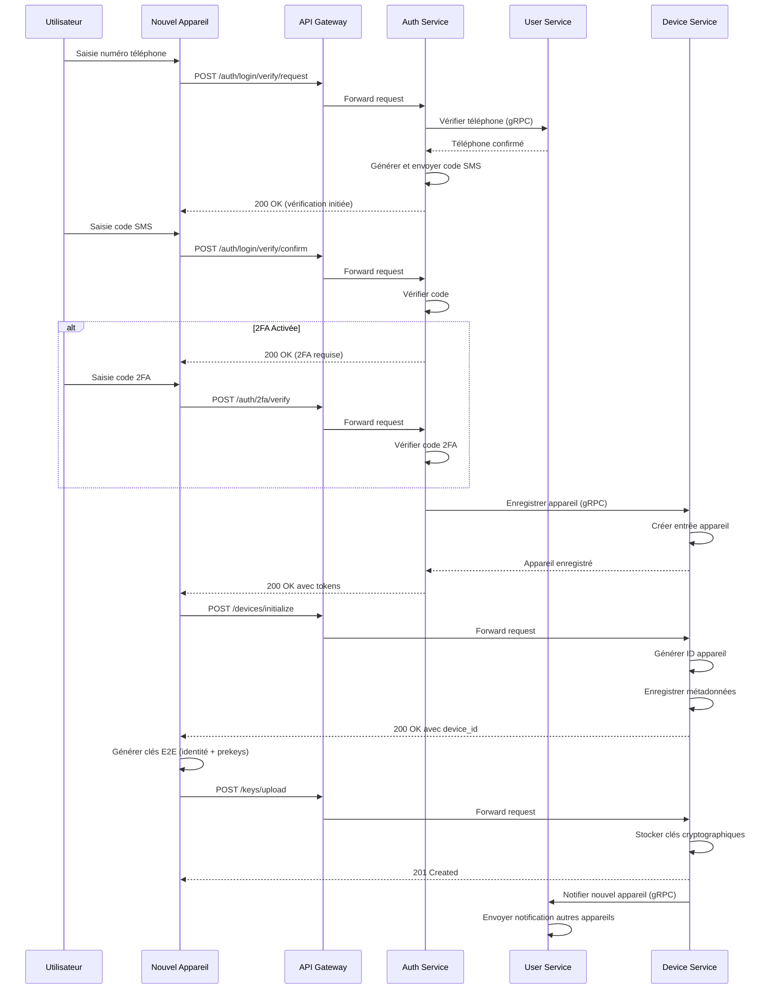
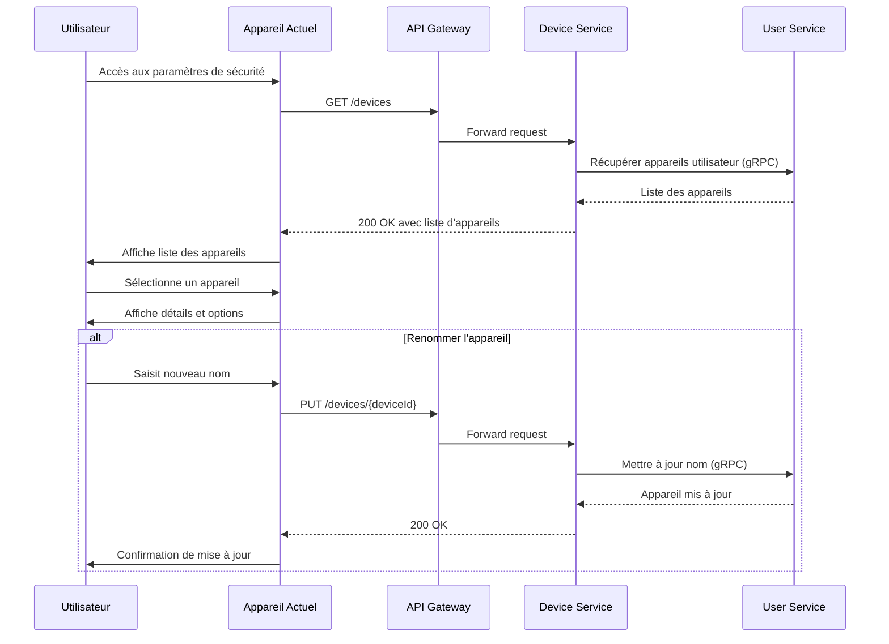
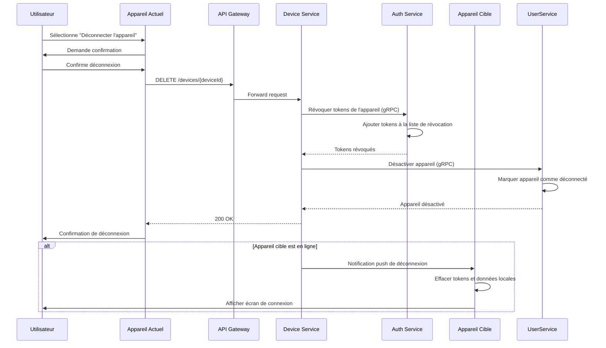
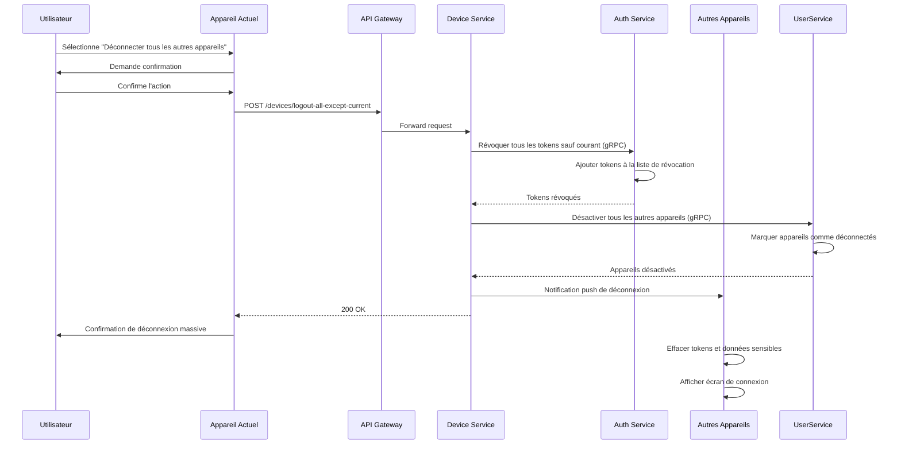
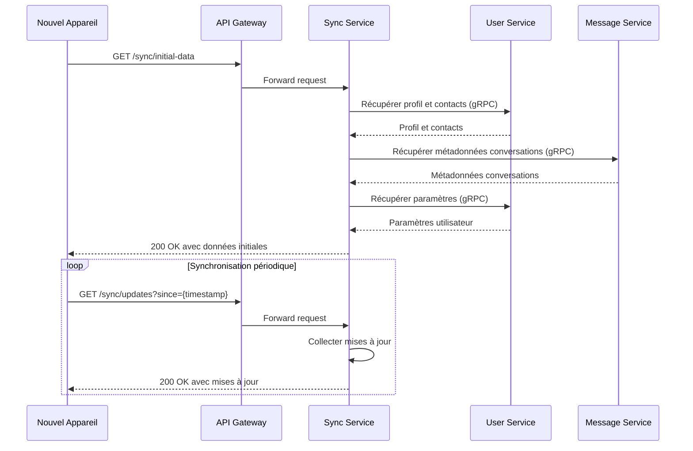
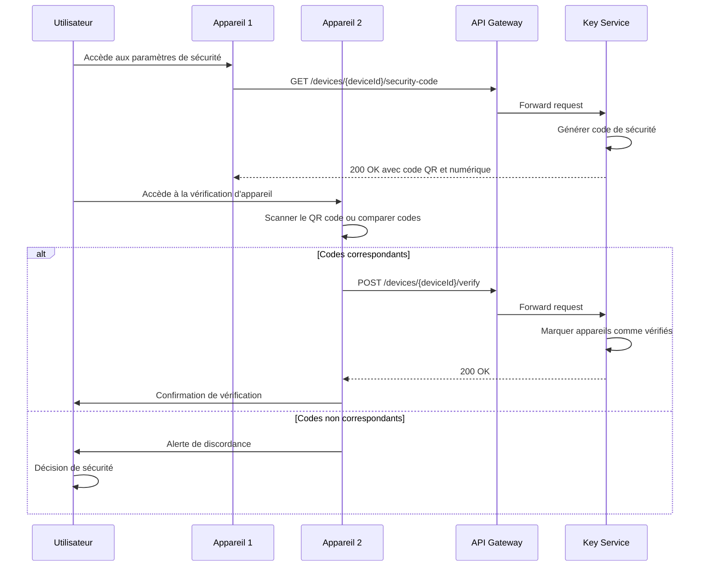

# Spécification Fonctionnelle - Gestion des Appareils

## 1. Vue d'ensemble

### 1.1 Objectif

Cette spécification détaille les fonctionnalités de gestion des appareils de l'application Whispr, permettant aux utilisateurs de gérer plusieurs terminaux connectés à leur compte. Ce module est essentiel pour l'expérience multi-appareils sécurisée et pour le chiffrement de bout en bout, chaque appareil devant être correctement enregistré et disposer des clés cryptographiques appropriées.

### 1.2 Principes clés

- **Transparence**: L'utilisateur a une visibilité complète sur tous les appareils connectés à son compte
- **Contrôle**: Possibilité de révoquer l'accès à distance pour n'importe quel appareil
- **Sécurité renforcée**: Appareils vérifiés et authentifiés individuellement
- **Expérience utilisateur fluide**: Synchronisation transparente des données essentielles
- **Gestion des clés E2E**: Distribution et vérification des clés cryptographiques entre appareils

### 1.3 Composants fonctionnels

Le système de gestion des appareils comprend cinq processus principaux:
1. **Enregistrement d'appareil**: Ajout d'un nouvel appareil au compte utilisateur
2. **Gestion des appareils**: Visualisation et contrôle des appareils connectés
3. **Déconnexion à distance**: Révocation d'accès d'un ou plusieurs appareils
4. **Synchronisation**: Transfert et mise à jour des données entre appareils
5. **Vérification de sécurité**: Confirmation de l'identité des appareils pour le E2E

## 2. Enregistrement d'un nouvel appareil

### 2.1 Méthodes d'enregistrement

L'application supporte deux méthodes principales d'ajout d'un nouvel appareil:

1. **Authentification par QR code**: Méthode privilégiée utilisant un appareil déjà connecté (détaillée dans la spécification d'authentification)
2. **Authentification directe**: Via le processus standard de vérification par SMS et éventuellement 2FA

Le diagramme ci-dessous illustre la méthode d'authentification directe:



### 2.2 Métadonnées d'appareil

Lors de l'enregistrement, les informations suivantes sont collectées:

- **Nom de l'appareil**: Défini par l'utilisateur ou généré automatiquement (ex: "iPhone de Jean")
- **Type d'appareil**: iOS, Android, Web
- **Modèle d'appareil**: Détecté automatiquement (ex: "iPhone 15", "Pixel 8")
- **Système d'exploitation**: Version détectée automatiquement
- **Token FCM/APNS**: Pour les notifications push
- **Adresse IP**: Pour la journalisation de sécurité
- **Localisation approximative**: Basée sur l'IP (pays/ville)
- **Date d'enregistrement**: Horodatage UTC

### 2.3 Initialisation et clés cryptographiques

Après authentification, un nouvel appareil doit:

1. **S'initialiser**: Recevoir un identifiant unique d'appareil
2. **Générer des clés**: Créer une clé d'identité et un ensemble de prekeys pour le protocole Signal
3. **Télécharger les clés**: Envoyer les clés publiques au serveur
4. **Obtenir les contacts**: Synchroniser la liste des contacts et conversations
5. **Obtenir les clés des contacts**: Télécharger les clés publiques des contacts existants

## 3. Gestion des appareils connectés

### 3.1 Interface de gestion des appareils

L'application fournit une interface dédiée permettant à l'utilisateur de:

- Visualiser tous les appareils actuellement connectés à son compte
- Voir les détails de chaque appareil (nom, modèle, dernière activité)
- Identifier l'appareil courant
- Renommer les appareils
- Déconnecter un appareil spécifique
- Déconnecter tous les autres appareils



### 3.2 Statut et activité des appareils

Pour chaque appareil, le système suit:

- **Statut de connexion**: En ligne / Hors ligne / Inconnu
- **Dernière activité**: Horodatage de la dernière interaction avec le serveur
- **Version de l'application**: Pour identifier les appareils nécessitant une mise à jour
- **Santé des clés**: État des clés cryptographiques (valides, expirées, à renouveler)

### 3.3 Indicateurs de sécurité

L'interface affiche des indicateurs visuels pour:

- **Appareils non vérifiés**: Appareils dont les clés n'ont pas été confirmées
- **Activité suspecte**: Connexions depuis des localisations inhabituelles
- **Appareils inactifs**: Appareils non utilisés depuis longtemps

## 4. Déconnexion à distance

### 4.1 Déconnexion d'un appareil spécifique



### 4.2 Déconnexion de tous les autres appareils

Cette fonctionnalité permet à l'utilisateur de déconnecter tous les appareils sauf celui qu'il utilise actuellement, utile en cas de suspicion de compromission du compte.



### 4.3 Effets de la déconnexion

Lorsqu'un appareil est déconnecté:

1. **Révocation des tokens**: Tous les tokens d'accès et de rafraîchissement sont révoqués
2. **Notification push**: Si l'appareil est en ligne, il reçoit une notification de déconnexion
3. **Effacement local**: L'application efface les tokens et données sensibles sur l'appareil
4. **Désactivation des clés**: Les clés cryptographiques associées sont marquées comme invalides
5. **Journalisation**: L'action est enregistrée dans l'historique de sécurité du compte

## 5. Synchronisation entre appareils

### 5.1 Données synchronisées

L'application synchronise les types de données suivants entre appareils:

- **Profil utilisateur**: Informations de base du profil
- **Liste de contacts**: Contacts de l'utilisateur
- **Conversations**: Métadonnées des conversations (mais pas nécessairement tous les messages)
- **Paramètres de confidentialité**: Préférences de vie privée
- **Statut des appareils**: Liste des appareils connectés et leur statut
- **Clés cryptographiques publiques**: Clés des contacts pour le chiffrement



### 5.2 Stratégies de synchronisation

L'application utilise plusieurs stratégies de synchronisation:

1. **Synchronisation initiale**: Lors de la première connexion d'un appareil
2. **Synchronisation pull**: Demandes périodiques pour récupérer les mises à jour
3. **Synchronisation push**: Notifications en temps réel via WebSockets ou push notifications
4. **Synchronisation à la demande**: L'utilisateur peut forcer une synchronisation

### 5.3 Gestion des conflits

En cas de modifications concurrentes:

- **Règle du dernier écrivain**: La dernière modification est généralement prioritaire
- **Résolution par fusion**: Pour certains types de données (listes, collections)
- **Notification à l'utilisateur**: Pour les conflits nécessitant une intervention manuelle
- **Journalisation**: Les conflits sont enregistrés pour analyse et débogage

## 6. Vérification de sécurité entre appareils

### 6.1 Vérification des clés d'identité

Pour garantir la sécurité des communications E2E, les appareils d'un même utilisateur doivent se vérifier mutuellement:



### 6.2 Codes de sécurité

Un code de sécurité est généré à partir des clés d'identité des deux appareils:

1. **Format numérique**: Séquence de chiffres facilement comparable (ex: "12-34-56-78-90-12")
2. **Format QR**: Code QR encodant les informations de vérification
3. **Empreinte visuelle**: Représentation graphique unique (similaire à Signal)

### 6.3 États de vérification

Un appareil peut avoir l'un des statuts suivants:

- **Non vérifié**: État initial après enregistrement
- **Vérifié**: Clés confirmées par l'utilisateur
- **En attente de vérification**: Vérification demandée mais non confirmée
- **Rejeté**: Appareil explicitement marqué comme non fiable

## 7. Aspects techniques

### 7.1 Structure de données

#### Table devices (PostgreSQL dans user-service)
```sql
CREATE TABLE devices (
    id UUID PRIMARY KEY DEFAULT uuid_generate_v4(),
    user_id UUID NOT NULL REFERENCES users(id) ON DELETE CASCADE,
    name VARCHAR(100) NOT NULL,
    device_type VARCHAR(20) NOT NULL,
    model VARCHAR(100),
    os_version VARCHAR(50),
    app_version VARCHAR(20),
    fcm_token VARCHAR(255),
    public_key TEXT,
    registration_ip VARCHAR(45),
    last_active_ip VARCHAR(45),
    last_active_at TIMESTAMP,
    is_verified BOOLEAN NOT NULL DEFAULT FALSE,
    is_active BOOLEAN NOT NULL DEFAULT TRUE,
    created_at TIMESTAMP NOT NULL DEFAULT NOW(),
    updated_at TIMESTAMP NOT NULL DEFAULT NOW()
);
CREATE INDEX idx_devices_user_id ON devices(user_id);
CREATE INDEX idx_devices_is_active ON devices(is_active);
```

#### Table device_keys (PostgreSQL dans auth-service)
```sql
CREATE TABLE device_keys (
    id UUID PRIMARY KEY DEFAULT uuid_generate_v4(),
    device_id UUID NOT NULL REFERENCES devices(id) ON DELETE CASCADE,
    identity_key TEXT NOT NULL,
    signed_prekey_id INTEGER NOT NULL,
    signed_prekey TEXT NOT NULL,
    signed_prekey_signature TEXT NOT NULL,
    created_at TIMESTAMP NOT NULL DEFAULT NOW(),
    updated_at TIMESTAMP NOT NULL DEFAULT NOW()
);
CREATE INDEX idx_device_keys_device_id ON device_keys(device_id);
```

#### Table device_verifications (PostgreSQL dans auth-service)
```sql
CREATE TABLE device_verifications (
    id UUID PRIMARY KEY DEFAULT uuid_generate_v4(),
    verifier_device_id UUID NOT NULL REFERENCES devices(id),
    verified_device_id UUID NOT NULL REFERENCES devices(id),
    verification_status VARCHAR(20) NOT NULL,
    verification_date TIMESTAMP,
    created_at TIMESTAMP NOT NULL DEFAULT NOW(),
    updated_at TIMESTAMP NOT NULL DEFAULT NOW(),
    UNIQUE(verifier_device_id, verified_device_id)
);
```

### 7.2 Endpoints API

| Endpoint | Méthode | Description | Paramètres |
|----------|---------|-------------|------------|
| `/devices` | GET | Liste tous les appareils de l'utilisateur | - |
| `/devices` | POST | Initialise un nouvel appareil | `{ name, type, model, osVersion }` |
| `/devices/{deviceId}` | GET | Obtient les détails d'un appareil | - |
| `/devices/{deviceId}` | PUT | Met à jour les informations d'un appareil | `{ name, fcmToken }` |
| `/devices/{deviceId}` | DELETE | Déconnecte un appareil | - |
| `/devices/logout-all-except-current` | POST | Déconnecte tous les autres appareils | - |
| `/devices/{deviceId}/security-code` | GET | Obtient le code de sécurité pour vérification | - |
| `/devices/{deviceId}/verify` | POST | Marque un appareil comme vérifié | `{ securityCodeHash }` |
| `/keys/upload` | POST | Téléverse les clés de l'appareil | `{ identityKey, signedPreKey, oneTimePreKeys }` |
| `/keys/{userId}/{deviceId}` | GET | Récupère les clés publiques d'un appareil | - |
| `/sync/initial-data` | GET | Récupère les données initiales pour un nouvel appareil | - |
| `/sync/updates` | GET | Récupère les mises à jour depuis un horodatage | `since` |

### 7.3 Notifications push

Les appareils sont notifiés des événements suivants:

- **Connexion d'un nouvel appareil**: Alerte de sécurité
- **Déconnexion à distance**: Pour effacer les données locales
- **Modification des clés**: Pour mettre à jour les clés de chiffrement
- **Changement de statut de vérification**: Mise à jour du statut des appareils
- **Forçage de synchronisation**: Demande de synchronisation immédiate

## 8. Tests

### 8.1 Tests unitaires
- Opérations CRUD sur les appareils
- Génération et validation des codes de sécurité
- Logique de synchronisation des données
- Révocation d'appareils et gestion des tokens

### 8.2 Tests d'intégration
- Enregistrement complet d'un nouvel appareil
- Synchronisation entre plusieurs appareils
- Processus de vérification croisée
- Déconnexion à distance et propagation des événements

### 8.3 Tests de sécurité
- Tentatives d'usurpation d'identité d'appareil
- Accès non autorisé aux clés d'autres appareils
- Prévention de l'énumération des appareils
- Tentatives de réutilisation de tokens révoqués

## 9. Livrables

### 9.1 Composants backend
- **DeviceModule**: Module de gestion des appareils (NestJS)
- **KeysModule**: Module de gestion des clés cryptographiques
- **SyncModule**: Module de synchronisation des données
- **NotificationService**: Service de notification des appareils
- **VerificationService**: Service de vérification des appareils

### 9.2 Composants frontend
- **Écran de gestion des appareils**: Interface listant tous les appareils
- **Écran de détails d'appareil**: Informations et options par appareil
- **Module de vérification**: Interface de vérification des codes de sécurité
- **Gestionnaire de synchronisation**: Logique de synchronisation côté client
- **Moniteur d'état de connexion**: Composant affichant l'état des appareils

### 9.3 Documentation
- **Guide d'implémentation**: Instructions pour les développeurs
- **Guide utilisateur**: Explications des fonctionnalités pour les utilisateurs
- **Documentation API**: Spécifications des endpoints
- **Diagrammes de séquence**: Flux d'interactions détaillés
- **Procédures de sécurité**: Protocoles pour la gestion des incidents