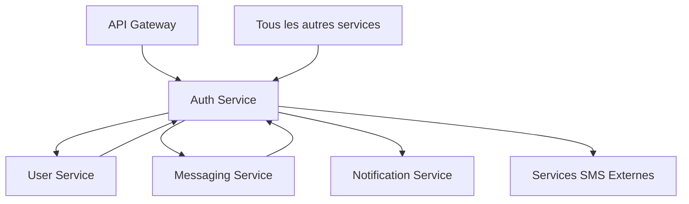
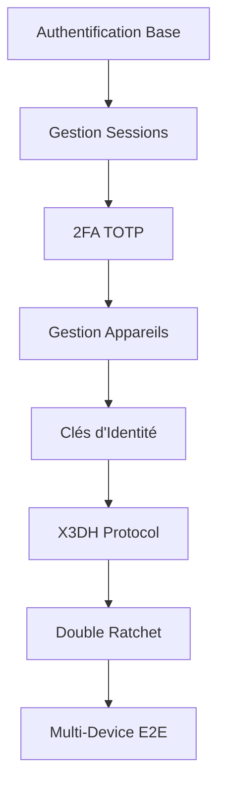

# Plan d'Implémentation - Service d'Authentification (Auth-Service)

## Vue d'ensemble

Ce plan d'implémentation structure le développement du service d'authentification sur 12 mois, avec une phase de P.O.C (septembre-décembre) suivie d'une phase d'implémentation complète (janvier-août). Le service auth est critique car il constitue le socle sécuritaire de l'ensemble de l'application Whispr.

## Phase 1 : Proof of Concept (Septembre - Décembre 2024)

### 🎯 Objectifs de la phase P.O.C
- Valider l'architecture de sécurité et les choix cryptographiques
- Prototyper les flux d'authentification critiques
- Tester l'intégration avec les services SMS externes
- Évaluer les performances des opérations cryptographiques
- Valider la faisabilité du protocole Signal E2E
- Identifier les risques de sécurité majeurs

### Septembre 2024 : Fondations Architecture

**Semaines 1-2 : Setup et Architecture de Sécurité**
- Configuration de l'environnement de développement sécurisé
- Setup du projet NestJS avec TypeScript et modules de sécurité
- Configuration PostgreSQL + Redis avec chiffrement
- Architecture des modules d'authentification
- Setup CI/CD avec tests de sécurité automatisés
- Configuration des variables d'environnement et secrets

**Semaines 3-4 : Modèle de données cryptographiques**
- Implémentation des entités : users_auth, devices, prekeys
- Configuration TypeORM avec chiffrement des colonnes sensibles
- Migrations sécurisées avec rotation des clés
- Tests unitaires sur les opérations cryptographiques
- Validation des contraintes de sécurité

### Octobre 2024 : Authentification Core

**Semaines 1-2 : Authentification par téléphone (P.O.C)**

Fonctionnalités prioritaires P.O.C
- Vérification SMS avec service externe (Twilio/Vonage)
- Génération et validation de codes de vérification
- Gestion des sessions JWT avec ES256
- Rate limiting et protection anti-brute force
- API REST endpoints d'authentification

**Semaines 3-4 : Gestion des tokens et sessions (P.O.C)**

Fonctionnalités prioritaires P.O.C
- Architecture tokens d'accès/refresh
- Gestion de la révocation de tokens
- Stockage sécurisé des sessions dans Redis
- Tests d'intégration avec user-service (gRPC)

### Novembre 2024 : Sécurité Avancée

**Semaines 1-2 : Authentification 2FA (P.O.C)**

Fonctionnalités prioritaires P.O.C
- Implémentation TOTP avec RFC 6238
- Génération QR codes et secrets TOTP
- Codes de secours avec hachage bcrypt
- Interface d'activation/désactivation 2FA

**Semaines 3-4 : Gestion des appareils (P.O.C)**

Fonctionnalités prioritaires P.O.C
- Enregistrement et authentification d'appareils
- Authentification par scan QR code
- Déconnexion à distance d'appareils
- Synchronisation basique entre appareils

### Décembre 2024 : Chiffrement E2E et Intégration

**Semaines 1-2 : Protocole Signal - Base (P.O.C)**
- Implémentation des primitives cryptographiques
- Génération et gestion des clés d'identité
- Système de prekeys (signed prekeys et one-time prekeys)
- Tests cryptographiques avec vecteurs de test

**Semaines 3-4 : Tests et Documentation P.O.C**
- Tests de sécurité et pénétration basiques
- Documentation technique et cryptographique
- Intégration complète avec user-service
- Retour d'expérience et recommandations sécurité
- Planification de la phase d'implémentation

### 📊 Livrables Phase P.O.C
- Architecture de sécurité validée et auditée
- Prototype fonctionnel des flux d'authentification
- Tests de sécurité et performance préliminaires
- Documentation des APIs et protocoles cryptographiques
- Plan détaillé pour la phase d'implémentation
- Rapport de sécurité et recommandations

---

## Phase 2 : Implémentation Complète (Janvier - Août 2025)

### 🎯 Objectifs de la phase d'implémentation
- Implémentation complète du protocole Signal
- Sécurisation avancée avec audit de sécurité
- Performance et scalabilité des opérations cryptographiques
- Intégration complète avec l'écosystème Whispr
- Conformité aux standards de sécurité (OWASP, NIST)
- Déploiement sécurisé en production

### Janvier 2025 : Consolidation et Sécurisation

**Semaines 1-2 : Hardening Post-P.O.C**
- Refactoring sécurisé basé sur les apprentissages P.O.C
- Durcissement de l'architecture de sécurité
- Mise en place des patterns cryptographiques définitifs
- Configuration sécurisée des environnements (dev, staging, prod)
- Audit de sécurité du code existant

**Semaines 3-4 : Authentification - Version Production**

Sprint 1 - Production Authentication

Epic: Production-Ready Authentication

Stories:
- Authentification robuste avec gestion d'erreurs
- Rate limiting avancé par IP/utilisateur/téléphone
- Logs d'audit et monitoring sécurisé
- Gestion des cas d'erreur et recovery
- API complète avec documentation OpenAPI

### Février 2025 : 2FA et Sécurité Avancée

**Semaines 1-2 : 2FA Production**

Sprint 2 - Advanced Two-Factor Authentication

Epic: Production 2FA System

Stories:
- Interface utilisateur complète pour 2FA
- Gestion avancée des codes de secours
- Support multi-applications d'authentification
- Recovery flows sécurisés
- Tests de sécurité approfondis

**Semaines 3-4 : Gestion avancée des appareils**

Sprint 3 - Advanced Device Management

Epic: Secure Multi-Device Management

Stories:
- Vérification croisée entre appareils
- Codes de sécurité cryptographiques
- Gestion des appareils compromis
- Synchronisation sécurisée des métadonnées
- Dashboard de sécurité pour les utilisateurs

### Mars 2025 : Chiffrement E2E - Partie 1

**Semaines 1-2 : X3DH et établissement de session**

Sprint 4 - X3DH Protocol Implementation

Epic: Signal Protocol - Session Establishment

Stories:
- Implémentation complète du protocole X3DH
- Gestion des prekeys avec rotation automatique
- Établissement asynchrone de sessions
- Tests cryptographiques complets
- Gestion des erreurs cryptographiques

**Semaines 3-4 : Double Ratchet Algorithm**

Sprint 5 - Double Ratchet Implementation

Epic: Signal Protocol - Double Ratchet

Stories:
- Implémentation du Double Ratchet complet
- Gestion des messages hors séquence
- Forward secrecy et future secrecy
- Optimisations performance pour mobile
- Tests de robustesse cryptographique

### Avril 2025 : Chiffrement E2E - Partie 2

**Semaines 1-2 : Multi-appareil et synchronisation**

Sprint 6 - Multi-Device E2E Encryption

Epic: Signal Protocol - Multi-Device Support

Stories:
- Synchronisation des sessions entre appareils
- Gestion des clés pour multiple devices
- Fan-out/fan-in pour les messages groupés
- Vérification des appareils utilisateur
- Tests de synchronisation cryptographique

**Semaines 3-4 : Gestion avancée des clés**

Sprint 7 - Advanced Key Management

Epic: Cryptographic Key Lifecycle

Stories:
- Rotation automatique des clés avec période configurable
- Sauvegarde et recovery des clés
- Audit trail complet des opérations sur les clés
- Performance des opérations cryptographiques
- Monitoring des opérations sensibles

### Mai 2025 : Performance et Scalabilité

**Semaines 1-2 : Optimisations cryptographiques**

Sprint 8 - Cryptographic Performance

Epic: Performance Optimization

Stories:
- Optimisation des opérations cryptographiques
- Cache intelligent pour les clés fréquemment utilisées
- Parallélisation des opérations coûteuses
- Benchmarking et profiling
- Tests de charge sur les opérations crypto

**Semaines 3-4 : Scalabilité et résilience**

Sprint 9 - Scalability & Resilience

Epic: Service Scalability

Stories:
- Scaling horizontal du service auth
- Réplication Redis avec haute disponibilité
- Circuit breakers pour services externes
- Monitoring avancé et alerting
- Tests de failover et disaster recovery

### Juin 2025 : Intégration et Communication

**Semaines 1-2 : Communication inter-services**

Sprint 10 - Inter-Service Communication

Epic: gRPC Integration & APIs

Stories:
- APIs gRPC robustes avec tous les services
- Gestion des timeouts et retry policies
- Validation des contrats d'API
- Documentation complète des interfaces
- Tests d'intégration end-to-end

**Semaines 3-4 : Services externes et monitoring**

Sprint 11 - External Services & Monitoring

Epic: External Integration & Observability

Stories:
- Intégration robuste avec services SMS
- Monitoring et alerting complets
- Dashboard opérationnel
- Gestion des incidents et escalade
- Documentation runbook opérationnel

### Juillet 2025 : Sécurité et Audit

**Semaines 1-2 : Audit de sécurité complet**

Sprint 12 - Security Audit & Hardening

Epic: Security Audit & Compliance

Stories:
- Audit de sécurité par expert externe
- Tests de pénétration spécialisés
- Validation OWASP Top 10
- Hardening configuration production
- Certification sécurité

**Semaines 3-4 : Tests de sécurité avancés**

Sprint 13 - Advanced Security Testing

Epic: Security Testing & Validation

Stories:
- Tests cryptographiques avec outils spécialisés
- Validation de la résistance aux attaques
- Tests de résistance au timing attacks
- Audit des logs et traces
- Plan de réponse aux incidents sécurité

### Août 2025 : Déploiement et Production

**Semaines 1-2 : Préparation production sécurisée**

Sprint 14 - Secure Production Deployment

Epic: Production Security Deployment

Stories:
- Configuration production sécurisée GKE
- Secrets management avec rotation
- Monitoring sécurisé et alerting
- Backup et disaster recovery
- Formation équipe sécurité

**Semaines 3-4 : Go-Live et Monitoring**

Sprint 15 - Production Launch & Monitoring

Epic: Secure Production Launch

Stories:
- Déploiement production avec blue/green
- Monitoring temps réel des métriques de sécurité
- Support utilisateur pour problèmes d'authentification
- Incident response et escalade
- Post-mortem sécurité et améliorations

---

## 📋 Matrice des Dépendances

### Dépendances Critiques

| Fonctionnalité | Dépend de | Requis pour |
|---------------|-----------|-------------|
| Authentification Base | Services SMS, Redis | Toutes les autres fonctionnalités |
| Gestion Sessions | Authentification | user-service, autres services |
| 2FA | Authentification, Sessions | Sécurité avancée |
| Gestion Appareils | Authentification, 2FA | Chiffrement E2E |
| Protocole Signal | Gestion Appareils | messaging-service |
| Multi-Device | Protocole Signal | Synchronisation complète |

### Intégrations Inter-Services

### Dépendances Cryptographiques

---

## 🛠️ Stack Technique et Outils

### Technologies Principales
- **Backend**: NestJS + TypeScript
- **Base de données**: PostgreSQL 14+ (avec chiffrement)
- **Cache**: Redis 7+ (avec HA)
- **Communication**: gRPC + REST
- **ORM**: TypeORM avec chiffrement des colonnes
- **Cryptographie**: libsignal-protocol-typescript, otplib
- **Tests**: Jest + Supertest + tests cryptographiques
- **Documentation**: OpenAPI/Swagger + documentation cryptographique

### Infrastructure et Sécurité
- **Orchestration**: Kubernetes (GKE) avec NetworkPolicies
- **CI/CD**: GitHub Actions avec tests de sécurité
- **Secrets**: Google Secret Manager avec rotation
- **Monitoring**: Prometheus + Grafana + alerting sécurité
- **Logging**: Loki avec logs d'audit
- **SMS**: Twilio/Vonage avec fallback

### Outils de Sécurité
- **SAST**: SonarQube avec règles de sécurité
- **Tests de sécurité**: OWASP ZAP, Burp Suite
- **Audit crypto**: Outils spécialisés pour Signal Protocol
- **Monitoring sécurité**: Détection d'anomalies

---

## 📊 Métriques de Succès

### Phase P.O.C
- ✅ Architecture de sécurité validée par expert
- ✅ Prototypes cryptographiques fonctionnels
- ✅ Tests de sécurité basiques passants
- ✅ Performance acceptable sur opérations crypto
- ✅ Intégration services externes validée

### Phase Implémentation
- ✅ Couverture de tests > 85% (incluant tests crypto)
- ✅ Temps de réponse authentification < 200ms (99e percentile)
- ✅ Temps de réponse opérations crypto < 500ms
- ✅ Audit de sécurité externe passant
- ✅ Conformité OWASP Top 10
- ✅ Tests de pénétration passants
- ✅ Déploiement production sécurisé réussi

### Métriques de Sécurité
- ✅ 0 vulnérabilité critique non résolue
- ✅ Temps de détection d'incident < 5 minutes
- ✅ Temps de résolution incident < 2 heures
- ✅ Uptime > 99.9%
- ✅ Taux d'échec authentification < 0.1%

---

## ⚠️ Risques et Mitigations

### Risques Techniques Spécifiques à l'Auth

| Risque | Probabilité | Impact | Mitigation |
|--------|-------------|--------|------------|
| Vulnérabilité crypto | Faible | Critique | Audit externe, tests spécialisés, utilisation de bibliothèques éprouvées |
| Performance crypto | Moyenne | Élevé | Benchmarking continu, optimisations, cache intelligent |
| Complexité Signal Protocol | Élevée | Élevé | P.O.C approfondi, expertise externe, tests extensifs |
| Intégration SMS | Moyenne | Élevé | Multiple providers, fallback, monitoring |
| Scalabilité Redis | Moyenne | Élevé | Cluster Redis, monitoring, tests de charge |

### Risques de Sécurité

| Risque | Probabilité | Impact | Mitigation |
|--------|-------------|--------|------------|
| Attaque cryptographique | Faible | Critique | Audit externe, protocoles éprouvés, monitoring |
| Compromission clés | Faible | Critique | Rotation automatique, HSM, séparation des clés |
| Attaque par timing | Moyenne | Moyen | Protection timing attack, tests spécialisés |
| Fuite de données | Faible | Critique | Chiffrement au repos, logs d'audit, monitoring |

### Risques Planning

| Risque | Probabilité | Impact | Mitigation |
|--------|-------------|--------|------------|
| Retard implémentation Signal | Élevée | Élevé | Démarrage précoce, expertise externe, buffer |
| Complexité multi-device | Élevée | Moyen | Prototypage approfondi, tests extensifs |
| Audit sécurité externe | Moyenne | Élevé | Planification précoce, budget dédié |

---

## 👥 Équipe et Ressources

### Équipe Core
- **1 Tech Lead Sécurité** (temps plein)
- **2 Développeurs Backend spécialisés crypto** (temps plein)
- **1 Expert Sécurité/Cryptographie** (50% temps)
- **1 DevSecOps** (temps plein)

### Support Spécialisé
- **Expert Signal Protocol** (consulting)
- **Auditeur Sécurité Externe** (audit)
- **Expert OWASP** (validation)
- **Testeur Pénétration** (tests sécurité)

### Support Transverse
- **Product Owner Sécurité** (suivi fonctionnel)
- **Architecte Solution** (cohérence technique)
- **Expert Juridique** (conformité)

---

## 🔒 Considérations de Sécurité Spéciales

### Phase P.O.C
- Environnement isolé pour les tests cryptographiques
- Pas de données utilisateur réelles
- Clés de test séparées des clés de production
- Audit de code automatisé sur chaque commit

### Phase Implémentation
- Séparation stricte des environnements
- Chiffrement de bout en bout des données sensibles
- Rotation automatique des secrets
- Monitoring en temps réel des tentatives d'intrusion
- Plan de réponse aux incidents détaillé

### Production
- Surveillance 24/7 des métriques de sécurité
- Alertes automatiques sur anomalies
- Backup chiffré et disaster recovery
- Audit trail complet de toutes les opérations
- Certification et audit réguliers

---

## 📅 Jalons Clés

| Date | Jalon | Critères de succès |
|------|-------|-------------------|
| **Fin Oct 2024** | Auth Core P.O.C | Authentification + Sessions + JWT |
| **Fin Nov 2024** | Sécurité Avancée P.O.C | 2FA + Multi-device + QR Auth |
| **Fin Déc 2024** | Crypto P.O.C Validé | Signal Protocol base + Tests crypto |
| **Fin Fév 2025** | Production Auth | Auth + 2FA + Devices en production |
| **Fin Avr 2025** | E2E Complet | Signal Protocol complet + Multi-device |
| **Fin Juin 2025** | Intégration Complète | Tous services intégrés + Monitoring |
| **Fin Juil 2025** | Audit Sécurité | Audit externe passant + Certification |
| **Mi-Août 2025** | Production Sécurisée | Déploiement sécurisé + Monitoring 24/7 |

---

## 📚 Documentation Spécialisée

### Documentation Technique
- Architecture de sécurité détaillée
- Spécifications cryptographiques complètes
- Guide d'implémentation Signal Protocol
- Documentation des APIs avec exemples sécurisés

### Documentation Opérationnelle
- Runbook de sécurité et incidents
- Procédures de rotation des clés
- Plan de disaster recovery
- Guide de monitoring et alerting

### Documentation Conformité
- Audit de sécurité et recommandations
- Conformité OWASP et standards
- Certification et validation externe
- Plan de mise à jour sécurité