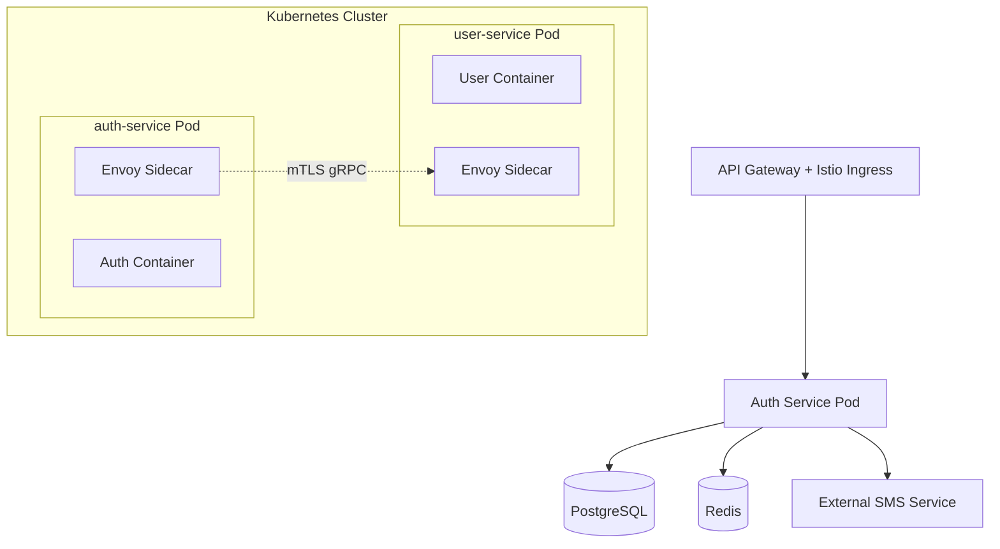

# System Architecture

The Authentication Service is a stateless microservice built with **NestJS**, designed to operate within an **Istio Service Mesh**.

## Global Architecture

The service interacts with other microservices (User, Notification) via **gRPC** over **mTLS**, managed automatically by Istio.

## Architectural Principles

- **Stateless**: All instances are interchangeable. State is kept in PostgreSQL and Redis.
- **Zero Trust**: All inter-service communications are encrypted and authenticated via mTLS (Istio).
- **Device-Centric**: Security is managed at the device level, not just the user level.
- **API First**: Full OpenAPI/Swagger documentation for all REST endpoints.

## Technical Stack

| Component | Technology |
| :--- | :--- |
| **Framework** | NestJS (TypeScript) |
| **Database** | PostgreSQL 15 |
| **Cache** | Redis 7 |
| **Communication** | REST (External), gRPC (Internal) |
| **Security** | JWT (ECDSA P-256), bcrypt, Signal Protocol |
| **Mesh** | Istio / Envoy |

## Service Structure

The code is organized by functional domains:
- `authentication`: Core JWT and login logic.
- `devices`: Multi-device management and QR login.
- `two-factor-authentication`: TOTP and backup codes.
- `phone-verification`: SMS provider integration.
- `tokens`: Refresh token rotation and lifecycle.
