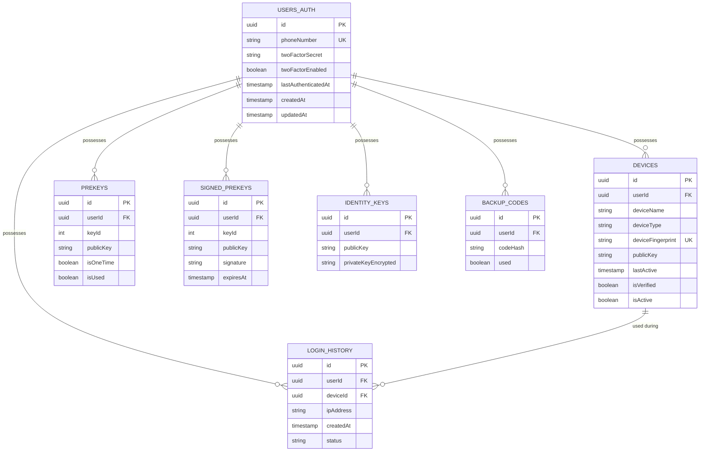

# Database Schema

The service uses **PostgreSQL** for persistent data and **Redis** for temporary/high-performance data.

## PostgreSQL Schema Overview

## Table Descriptions

### USERS_AUTH
The core table for user identity.
- `phoneNumber`: Unique E.164 identifier.
- `twoFactorSecret`: Encrypted TOTP secret.

### DEVICES
Tracks all hardware/browsers associated with a user.
- `deviceFingerprint`: Unique identifier generated by the client.
- `publicKey`: The Signal Protocol public key for this specific device.

### Cryptographic Keys (Signal Protocol)
- **PREKEYS**: One-time use keys for asynchronous messaging.
- **SIGNED_PREKEYS**: Semi-persistent keys signed by the Identity Key.
- **IDENTITY_KEYS**: Long-term keys identifying the user.

## Redis Structures

Redis is used for high-availability temporary data with short TTLs:

- **Verification Codes**: `verification:{id}` - SMS codes (TTL: 15m).
- **Active Sessions**: `session:{id}` - JWT metadata for revocation (TTL: variable).
- **QR Challenges**: `qr_challenge:{id}` - Temporary challenges for QR login (TTL: 5m).
- **Rate Limits**: `rate_limit:{type}:{id}` - Brute-force protection counters.
